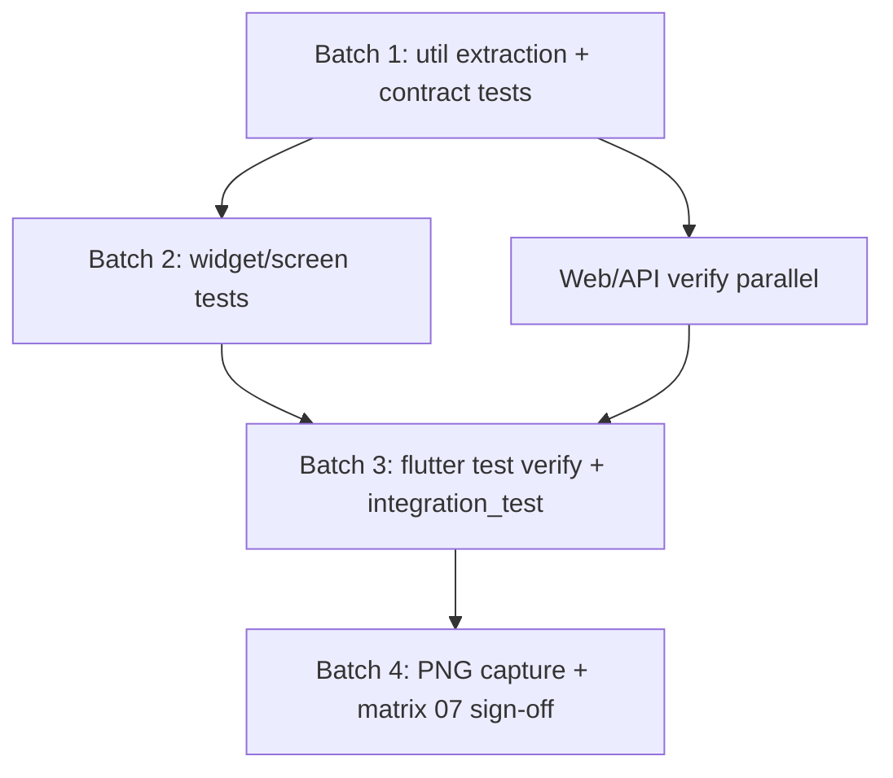

# Partials completion plan — 10 mobile Partial tasks

**Date:** 2026-06-18  
**Backlog:** 333 Done / 0 Pending / 10 Partial (`plan/03-task-backlog.md`)  
**Canonical:** `docs/dev/HANDOFF-continue-standard-product.md`, `spec/sdd/07-product-readiness-matrix.md` §8–§10

## Goal

Close the **10 Partial** mobile product-readiness tasks (P15-T13, P18-T06/T09/T10/T13/T16/T17/T18/T20, P20-T03/T08) without falsely marking **Product-ready** until `flutter test --coverage` passes locally and M2/M3 PNG packs are captured.

## Partial tasks and remaining gates

| Task | Scope | Remaining gate |
|------|-------|----------------|
| P15-T13 | M2 mobile screenshots | **PNG** — device/emulator capture |
| P20-T03 | M2 PRODUCT mobile screenshots | **PNG** — same |
| P18-T09 | M2 PRODUCT Product-ready | **PNG** + **`flutter test --coverage` green** |
| P18-T06/T10 | CRM LEAD/CONTACT mobile | **PNG** + screen depth |
| P18-T13 | Grid bulk actions mobile | **`flutter test --coverage`** after screen tests |
| P18-T16 | Entity platform mobile | **VERIFY** + PNG |
| P18-T17 | STOCK_MOVEMENT mobile | **VERIFY** + PNG |
| P18-T18 | Document preview mobile | **VERIFY** + PNG |
| P18-T20 | Grid realtime/offline mobile | **VERIFY** + PNG |
| P20-T08 | Matrix 07 milestone rev | **SIGNOFF** — needs PNG + flutter green |

**Gate taxonomy**

- **VERIFY** — run `cd clients/mobile && flutter pub get && flutter test --coverage` on developer machine (Flutter SDK on PATH; see `known-pitfalls.md` § Flutter PATH)
- **PNG** — follow M2 runbook; emulator/device required
- **SIGNOFF** — matrix 07 row cannot move to Product-ready without PNG evidence

## Dependency DAG



| Layer | Depends on | Unblocks |
|-------|------------|----------|
| Util extraction (`bulk_grid_util`, `stock_movement_util`) | — | Screen tests, bulk/movement UX |
| Contract tests (no widget pump) | Util + fixtures | Confidence before screen layer |
| Widget/screen tests | Contract + `EmcapClient` fakes | `flutter test --coverage` verify |
| `integration_test/` device flows | Screen tests green | PNG runbook |
| PNG + matrix 07 | Green `flutter test --coverage` | Partial → Done |

## Batches

### Batch 1 — DONE (2026-06-18)

- Extract `clients/mobile/lib/utils/bulk_grid_util.dart`, `stock_movement_util.dart`
- Refactor `entity_list_screen.dart`, `entity_record_screen.dart` to use utils
- Expand contract tests:
  - `entity_list_bulk_test.dart` (10)
  - `document_preview_util_test.dart` (24)
  - `entity_platform_mobile_test.dart`
  - `entity_record_movement_test.dart` (9)
  - `crm_entity_contract_test.dart` (13)
  - `mobile_sse_grid_test.dart` (8)
- Web **437/437**; branches **80.12%**; API **299** passed **92%** cov
- All 10 partials remain **Partial** (PNG capture pending)

### Batch 2 — widget/screen tests

| File | Covers |
|------|--------|
| `test/entity_list_screen_bulk_test.dart` | Bulk toolbar, delete guard, export |
| `test/entity_list_screen_sse_test.dart` | Offline/reload banner, realtime label |
| `test/document_preview_dialog_test.dart` | Dialog modes (text/image/pdf/error/virus) |
| `test/lookup_field_test.dart` | Lookup picker stub |
| `test/entity_record_screen_lifecycle_test.dart` | Soft-delete restore banner |
| `test/entity_record_screen_movement_test.dart` | Post movement button flow |
| `test/crm_record_screen_test.dart` | LEAD hero smoke |

### Batch 3 — Flutter verify

1. `cd clients/mobile && flutter pub get && flutter test --coverage` — full suite including Batch 2 screen tests
2. `cd clients/mobile && flutter analyze`
3. `integration_test/m2_product_detail_test.dart` on emulator
4. Re-run targeted API + web CI (regression guard)
5. Update backlog Partial notes with verify counts; keep status **Partial** until PNG

### Batch 4 — PNG + Product-ready sign-off

1. Follow `docs/dev/session-memos/2026-06-13-s2-m2-mobile-screenshot-prep.md` runbook
2. Capture M2 PRODUCT detail, bulk grid, movement post, document preview, CRM LEAD
3. Sign matrix 07 §8–§10 mobile rows → **Product-ready**
4. P15-T13, P20-T03, P18-T06/T09/T10/T16/T17/T18/T20 → **Done**
5. P20-T08 matrix rev with milestone evidence

## Verification commands

```bat
cd clients\web && npm run test:ci && npm run test:coverage
cd platform\api && python -m pytest tests/test_entity_system_contract.py tests/test_inventory_product_smoke.py tests/test_migrations.py tests/test_module_report_menus.py -q
cd platform\api && python -m pytest --cov=emcap --cov-fail-under=80 -q
cd clients\mobile && flutter pub get && flutter test --coverage
cd clients\mobile && flutter analyze
node scripts/e2e-smoke.mjs
node scripts/audit-i18n.mjs
```

## Honest status rule

- **Partial** until both `flutter test --coverage` green locally **and** M2/M3 PNG attached
- Never mark matrix 07 Product-ready from pytest/Karma alone
- Doc sync on every batch: HANDOFF, `codebase-index.md` test table, backlog Partial notes

## Open follow-ups

- Batch 3 `flutter pub get && flutter test --coverage` on developer machine (Flutter stable on PATH outside Downloads)
- M2 mobile PNG pack (`scripts/capture-m2-mobile-screenshots.md`) after tests green
- P20-T08 final matrix 07 rev after Batch 4
