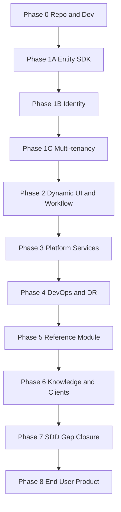

# EMCAP — Implementation Plan

> **Status (2026-06-11):** Phases 0–8 delivered. See `plan/03-task-backlog.md` (131/131 Done) and `spec/sdd/05-end-user-matrix.md`.

Phased delivery aligned with SDD v1.0. Each phase ends with a demonstrable vertical slice.

## Guiding Principles

1. **Platform first, modules second** — core must not require changes when adding business modules.
2. **Config over code** — tenancy, modules, auth providers, channels via YAML.
3. **Metadata contract** — one backend schema drives Angular, Flutter, and future renderers.
4. **Test gates from day one** — lint, unit, integration, security scan in CI before UAT.

---

## Phase 0 — Repository & Local Dev (Weeks 1–2)

**Goal:** Runnable monorepo skeleton with Docker Compose and CI skeleton.

| Deliverable | SDD refs |
|-------------|----------|
| Monorepo layout: `platform/`, `modules/`, `infra/`, `clients/` | §6, §21 |
| Docker Compose: FastAPI, PostgreSQL, Redis, MinIO | §21 |
| Config loader: `platform.*`, `tenant_strategy.*`, `modules.*` | §3–5 |
| GitFlow + branch protection | §24 |
| CI: lint (Ruff, Black, MyPy, ESLint, Flutter Analyze) | §24 |
| Cursor skills Tier 1 + core rules | Skills assessment |

**Exit criteria:** `docker compose up` starts API + DB; health endpoint returns tenant mode from config.

---

## Phase 1 — Platform Core (Weeks 3–8)

**Goal:** Entity framework + identity + tenancy foundation.

### 1A — Entity Framework & SDK

| Deliverable | SDD refs |
|-------------|----------|
| `EntityDefinition` registry and validation | §8 |
| Auto-generated CRUD APIs, search, audit hooks | §8, §19 |
| `ModuleDefinition` plugin loader (isolated deploy) | §26–27 |
| Permissions + dynamic menus from module metadata | §26 |

### 1B — Identity & Authorization

| Deliverable | SDD refs |
|-------------|----------|
| Configurable auth: username/password, OAuth (LDAP/SSO stubs) | §7 |
| RBAC + ABAC foundation | §7 |
| Row security + field security hooks on entity layer | §7 |
| MFA, rate limiting, security headers | §20 |

### 1C — Multi-Tenancy

| Deliverable | SDD refs |
|-------------|----------|
| Tenant context middleware | §3–4 |
| `shared_database` strategy (first) | §4 |
| Schema-per-tenant + database-per-tenant adapters | §4 |
| White-label config (domains, themes) | §3 |

**Exit criteria:** Register `CUSTOMER` entity via definition; CRUD + audit + permissions work in single-org and SaaS mode.

---

## Phase 2 — Dynamic UI & Workflow (Weeks 9–14)

**Goal:** Metadata-driven forms/grids on Angular + Flutter with contract tests.

| Deliverable | SDD refs |
|-------------|----------|
| Form metadata schema: layout, validation, conditional logic, i18n | §9 |
| Grid metadata schema: export, grouping, realtime, offline flags | §9 |
| Angular dynamic form + grid renderers | §9 |
| Flutter dynamic form + grid renderers | §9 |
| Contract tests: backend metadata ↔ Angular ↔ Flutter | §25 |
| Workflow engine: enable, escalation, delegation, SLA | §10 |
| Rule engine: formula mode (scripting flag off initially) | §11 |

**Exit criteria:** Same entity renders identically on web and mobile from shared metadata; workflow state transitions audited.

---

## Phase 3 — Platform Services (Weeks 15–22)

**Goal:** Optional subsystems behind feature flags.

| Subsystem | Flag | SDD |
|-----------|------|-----|
| Reporting | always on core | §12 |
| Notifications | `notifications.*` | §13 |
| Documents | entity option | §14 |
| Integrations | module-level | §15 |
| Payments | `payments.enabled` | §16 |
| AI | `ai.enabled` | §17 |
| Observability | built-in | §18 |

**Exit criteria:** Each subsystem toggled off in config leaves no runtime dependency; enabled subsystems pass integration tests.

---

## Phase 4 — DevOps & Production Readiness (Weeks 23–28)

**Goal:** UAT/prod on Kubernetes with IaC and DR.

| Deliverable | SDD refs |
|-------------|----------|
| Terraform + Helm for UAT/prod | §21–22 |
| Full CI/CD: unit → integration → security → deploy → smoke | §23 |
| Ansible for config/provisioning where needed | §22 |
| DR: PITR, daily backups, RPO <15m, RTO <1h | §29 |
| Release: semver, migrations, rollback | §28 |

**Exit criteria:** Automated deploy to UAT; documented rollback; observability dashboards live.

---

## Phase 5 — Reference Business Module (Weeks 29–32)

**Goal:** Prove Definition of Done with one plug-in module (e.g. Inventory or CRM).

| Deliverable | SDD refs |
|-------------|----------|
| `ModuleDefinition(entities, workflows, reports, dashboards, menus)` only | §30 |
| Independent module deployment | §27 |
| ≥80% test coverage module + platform touchpoints | §25 |

**Exit criteria:** New module shipped without modifying `platform/` core; all DoD capabilities received automatically.

---

## Phase 6 — Knowledge Base + Client Completion

**Goal:** In-repo agent memory and complete client shell parity (reports UI, smoke scripts).

| Deliverable | SDD refs |
|-------------|----------|
| Codebase index, pitfalls, implementation recipes | Document control |
| Cursor SDD workflow rule + codebase-map skill | Agent guidance |
| Reports UI (`listReports`, `runReport`) web + mobile | §9, FR-011 |
| Full-stack verify scripts | §25, NFR-010 |

**Exit criteria:** `docs/dev/` memory complete; LOW_STOCK runnable from Reports nav; `verify-full-stack` script green (API health optional if stack down).

Playbook: `plan/05-phase6-playbook.md`

---

## Phase 7 — SDD Gap Closure (complete)

**Goal:** Close **Partial** and **No** rows in `spec/sdd/04-capability-matrix.md` — platform services wired in thin shells.

Playbook: `plan/06-sdd-gap-closure.md` · **108/108** backlog tasks Done.

---

## Phase 8 — End-User Product Depth (complete)

**Goal:** Close **No** and **Partial** rows in `spec/sdd/05-end-user-matrix.md` — business users can edit, search, validate, export, authenticate fully, and use a second module (CRM).

| Wave | Deliverable | SDD refs |
|------|-------------|----------|
| 1 | Record edit/delete, search, pagination | §8, §9, FR-008c |
| 2 | Form validation, conditions, i18n; grid sort/filter/group/export | §9 |
| 3 | MFA, OAuth/SSO, full SaaS tenant + themes | §7, §3 |
| 4 | Documents, workflow start, reports, notifications, integrations, AI UI | §10–17 |
| 5 | CRM module, renderer contract tests, prod sign-off, doc sync | §27, §25, §29 |

**Exit criteria:** Met — see `spec/sdd/05-end-user-matrix.md` and `plan/03-task-backlog.md` (131/131).

Playbook: `plan/07-phase8-end-user-product.md`

---

## Dependency Graph

---

## Risks & Mitigations

| Risk | Mitigation |
|------|------------|
| Metadata contract drift across clients | Contract tests in CI (mandatory merge gate) |
| Multi-tenant isolation bugs | Start shared DB; add strategies incrementally with isolation test suite |
| Scope creep (AI, payments, all modules) | Feature flags default off; one reference module in Phase 5 |
| 90% coverage target | Enforce 80% in CI first; raise gate per phase |
