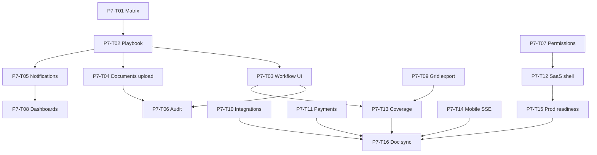

# Phase 7 — SDD Gap Closure (§2 Partial/No → Done)

Closes remaining **Partial** and **No** rows in [`spec/sdd/04-capability-matrix.md`](../spec/sdd/04-capability-matrix.md).

**Before any task:** read `docs/dev/codebase-index.md`, `docs/dev/known-pitfalls.md`, matching recipe in `docs/dev/recipes/`.

**After any task:** update capability matrix status, traceability row, `plan/03-task-backlog.md`, run verify commands.

---

## Wave 0 — Planning (complete)

### P7-T01 — Capability matrix

**Deliverable:** `spec/sdd/04-capability-matrix.md`  
**Verify:** Every SDD §2 goal has API/Web/Mobile/Infra column + Phase 7 task ID.

### P7-T02 — Playbook + backlog

**Deliverable:** this file + Phase 7 section in `plan/03-task-backlog.md`  
**Verify:** 16 implementation tasks with file paths and verify commands.

---

## Wave 1 — Client: Partial → Done

### P7-T03 — Workflow actions (web + mobile)

**Gap:** Inbox lists instances; no transition/delegate in shells.  
**Req:** FR-009, FR-008a

| Step | File |
|------|------|
| 1 | `clients/web/src/api/emcap-client.ts` — `transitionWorkflow(instanceId, action)`, `delegateWorkflow(instanceId, assignee)` |
| 2 | `clients/web/src/api/emcap-client.test.ts` — add to `REQUIRED_METHODS` |
| 3 | `clients/mobile/lib/api/emcap_client.dart` — same methods |
| 4 | `clients/web/src/app/main.ts` — inbox row actions (approve/reject/delegate buttons) |
| 5 | `clients/mobile/lib/app/workflow_inbox_screen.dart` — action buttons per instance |
| 6 | `plan/04-client-api-completion.md` — mapping table |

**API (existing):** `POST /api/v1/workflows/instances/{id}/transition`, delegate route per `workflows.py`.

**Verify:**

```powershell
cd platform/api; python -m pytest -q tests/test_inventory_e2e.py -k workflow
cd clients/web; npm run lint; npm test
```

---

### P7-T04 — Document upload (web + mobile)

**Gap:** List documents on record; no upload UI.  
**Req:** FR-013, FR-008a

| Step | File |
|------|------|
| 1 | `emcap-client.ts` — `uploadDocument(entityCode, recordId, filename, content)` |
| 2 | `emcap_client.dart` — same |
| 3 | Web record detail panel — file input + upload button |
| 4 | Mobile entity screen — upload button on selected record |
| 5 | Recipe: `docs/dev/recipes/add-document-upload-ui.md` |

**API:** `POST /api/v1/documents/upload` (JSON body with base64/text content).

**Verify:** `test_client_api_gaps.py::test_document_list_by_record` + manual upload in shell.

---

### P7-T05 — Notifications UI (web + mobile)

**Gap:** API only.  
**Req:** FR-012, FR-008a

| Step | File |
|------|------|
| 1 | Client methods: `listNotifications()`, `sendNotification(payload)` |
| 2 | Web nav **Notifications** — list + simple send form |
| 3 | Mobile rail **Notifications** — `notification_screen.dart` |
| 4 | Recipe: `docs/dev/recipes/add-notification-ui.md` |

**API:** `GET/POST /api/v1/notifications` — respect `modules.notifications.enabled`.

**Verify:** `test_platform_services.py::test_notification_hub`

---

### P7-T06 — Audit viewer (web + mobile)

**Gap:** API audit on entities; no UI.  
**Req:** FR-017, FR-008a

| Step | File |
|------|------|
| 1 | Client: `listAudit(entityCode, recordId?)` → `GET /api/v1/entities/{entity}/audit` |
| 2 | Web record detail — audit tab/table |
| 3 | Mobile record detail — audit list |
| 4 | Recipe: `docs/dev/recipes/add-audit-viewer.md` |

**Verify:** `test_health.py` audit assertions; inventory audit via e2e.

---

### P7-T07 — Permissions viewer (web + mobile)

**Gap:** Token auth only; no RBAC visibility.  
**Req:** FR-002, FR-008a

| Step | File |
|------|------|
| 1 | Client: `getPermissions()`, `getRoles()` (existing API routes) |
| 2 | Web **Account** or **Admin** nav — read-only permissions list |
| 3 | Mobile — settings screen with permissions |

**Verify:** `test_auth_security.py::test_rbac_roles`

---

### P7-T08 — Dashboards UI (web + mobile)

**Gap:** `GET /api/v1/dashboards` not consumed in shells.  
**Req:** FR-011, FR-008a

| Step | File |
|------|------|
| 1 | Client: `listDashboards()` |
| 2 | Web **Dashboards** nav — render `INVENTORY_OVERVIEW` widgets |
| 3 | Mobile `dashboard_screen.dart` + rail entry |

**Verify:** `test_inventory_e2e.py::test_inventory_overview_dashboard`

---

### P7-T09 — Grid export (web; mobile optional)

**Gap:** Metadata has `export.csv` etc.; UI ignores flags.  
**Req:** FR-008, FR-008a

| Step | File |
|------|------|
| 1 | Web entity view — if `gridMeta.export.csv`, **Export CSV** button (client-side from loaded records) |
| 2 | Mobile — share CSV via platform channel (optional) |

**No new API** — export from already-fetched records.

**Verify:** Contract test grid metadata includes export flags.

---

## Wave 2 — Client: No → Done / Stub

### P7-T10 — Integrations status UI

**Gap:** Integration routes stub; no client.  
**Req:** FR-014

| Step | File |
|------|------|
| 1 | Client: `listIntegrations()` or health of integration adapter endpoint |
| 2 | Read-only status screen web + mobile |
| 3 | Hide when no integrations configured |

**Verify:** `test_platform_services.py` integration test if present.

---

### P7-T11 — Payments UI (feature-flag gated)

**Gap:** Payments stub; `payments.enabled: false`.  
**Req:** FR-015, FR-005

| Step | File |
|------|------|
| 1 | Client: `listPaymentMethods()` / stub charge — only when config enables |
| 2 | Shell shows **Payments** nav only if `GET /api/v1/config/platform` → `payments.enabled` |
| 3 | Do not enable in default `config/platform.yaml` until gateway creds exist |

**Verify:** Payment routes return 403/disabled when flag off.

---

## Wave 3 — Platform modes (SDD §3)

### P7-T12 — Tenant picker + white-label theme

**Gap:** SaaS/white-label config exists; shells are single-tenant UX.  
**Req:** FR-003, FR-004

| Step | File |
|------|------|
| 1 | After login, if `multi_tenant` from health/config — show tenant selector (or use login `tenant_id`) |
| 2 | White-label: read theme tokens from config API or static `clients/web/theme.json` per tenant |
| 3 | Mobile `ThemeData` from dart-define or fetched config |
| 4 | Document in `docs/dev/saas-shell.md` |

**Verify:** `test_auth_security.py::test_tenant_header_isolation`, `test_tenant_white_label_config`

---

## Wave 4 — NFR & infra

### P7-T13 — Coverage gates + contract expansion

**Req:** NFR-003, NFR-004, NFR-013

| Step | File |
|------|------|
| 1 | `.github/workflows/ci.yml` — `pytest --cov` with fail-under 80 (start 70 if needed, ratchet) |
| 2 | Web: vitest coverage script; mobile: `flutter test --coverage` in CI when SDK available |
| 3 | Extend `emcap-client.test.ts` for each new P7 client method |
| 4 | Recipe: `docs/dev/recipes/add-coverage-gate.md` |

---

### P7-T14 — Mobile SSE parity (optional)

**Gap:** Web has `subscribeRecordsStream`; mobile pull-only.  
**Req:** FR-008a

| Step | File |
|------|------|
| 1 | `emcap_client.dart` — HTTP stream listener with auth headers |
| 2 | `entity_screen.dart` — refresh on heartbeat when `grid.realtime` |

**Pitfall:** Do not use raw EventSource pattern; use authenticated stream (see `known-pitfalls.md`).

---

### P7-T15 — Production readiness sign-off

**Req:** NFR-001, NFR-002, NFR-008, NFR-015

| Step | File |
|------|------|
| 1 | `docs/ops/production-readiness.md` — checklist: HPA, multi-AZ, DR drill, 99.9% target |
| 2 | Helm `values-prod.yaml` — document replica count, PDB |
| 3 | Run DR drill steps from `docs/ops/dr-runbook.md` (tabletop OK for study repo) |

---

## Wave 5 — SDD doc sync

### P7-T16 — Traceability + matrix + session summary

| File | Update |
|------|--------|
| `spec/sdd/03-traceability-matrix.md` | Phase 7 rows per task |
| `spec/sdd/04-capability-matrix.md` | Mark Done as tasks complete |
| `plan/00-session-summary.md` | Phase 7 progress |
| `docs/modules/inventory-definition-of-done.md` | Client UI rows for new capabilities |
| `docs/dev/known-pitfalls.md` | New pitfalls from P7 |
| `docs/dev/recall-index.md` | Phase 7 summary pointer |

---

## Dependency graph



---

## Global verify (after each wave)

```powershell
.\scripts\verify-full-stack.ps1
.\scripts\verify-platform-core.ps1
```

---

## Exit criteria (Phase 7 complete)

- All rows in `04-capability-matrix.md` are **Done** or documented **Stub** with feature flag off.
- Client API contract tests list every shell method.
- Coverage gate ≥80% backend in CI (or documented ratchet plan).
- **108/108** backlog tasks Done (92 + 16 Phase 7).
