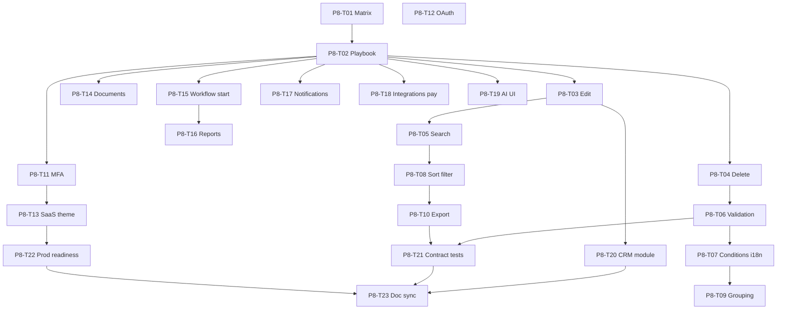

# Phase 8 — End-User Product Depth (§9 UX + §27 modules)

Closes **No** and **Partial** rows in [`spec/sdd/05-end-user-matrix.md`](../spec/sdd/05-end-user-matrix.md).

Phase 7 wired platform services into thin shells. Phase 8 makes shells **usable by business end users** per `spec/framework-sdd.txt` §9.

**Status:** Complete — 2026-06-11 · **131/131** backlog Done.

**Before any task:** read `docs/dev/codebase-index.md`, `docs/dev/known-pitfalls.md`, matching recipe in `docs/dev/recipes/`.

**After any task:** update `05-end-user-matrix.md`, traceability row, `plan/03-task-backlog.md`, run verify commands.

---

## Wave 0 — Planning (complete)

### P8-T01 — End-user capability matrix ✅

**Deliverable:** `spec/sdd/05-end-user-matrix.md`  
**Verify:** Every §9 end-user flow has Web/Mobile column + Phase 8 task ID.

### P8-T02 — Playbook + backlog ✅

**Deliverable:** this file + Phase 8 section in `plan/03-task-backlog.md`  
**Verify:** 23 implementation tasks with file paths and verify commands.

---

## Wave 1 — Entity CRUD completeness

### P8-T03 — Record edit UI (web + mobile)

**Gap:** Create-only; `updateRecord` in client API unused.  
**Req:** FR-006, FR-008c

| Step | File |
|------|------|
| 1 | Web record detail — pre-fill form from `getRecord()`, Save → `updateRecord()` |
| 2 | Mobile `entity_screen.dart` — edit mode on selected record |
| 3 | Recipe: `docs/dev/recipes/add-record-edit-ui.md` |
| 4 | `plan/04-client-api-completion.md` — note edit flow |

**API (existing):** `PUT /api/v1/entities/{entity}/records/{id}`

**Verify:**

```powershell
cd platform/api; python -m pytest -q tests/test_health.py -k customer
cd clients/web; npm run lint; npm test
```

---

### P8-T04 — Record delete with confirm (web + mobile)

**Gap:** No delete action in shells.  
**Req:** FR-006, FR-008c

| Step | File |
|------|------|
| 1 | Web record detail — Delete button + confirm dialog → `deleteRecord()` |
| 2 | Mobile — delete icon on selected record with confirm |
| 3 | Refresh grid after delete; clear selection |

**API (existing):** `DELETE /api/v1/entities/{entity}/records/{id}`

**Verify:** `test_platform_core_unchanged.py` PRODUCT CRUD; manual delete in shell.

---

### P8-T05 — Entity search + pagination (web + mobile)

**Gap:** API supports `?q=`; shells load all records.  
**Req:** FR-006, FR-008c

| Step | File |
|------|------|
| 1 | Client: `listRecords(entity, { q?, page?, pageSize? })` if API paginates; else client-side filter + page slice |
| 2 | Web entity view — search input + prev/next page controls |
| 3 | Mobile entity screen — search field + load-more or page buttons |
| 4 | Recipe: `docs/dev/recipes/add-entity-search-pagination.md` |

**Verify:** `test_platform_core_unchanged.py` search param; manual search "CORE" on Products.

---

## Wave 2 — Dynamic UI depth (§9)

### P8-T06 — Form validation + field types

**Gap:** Renderers list field names; ignore `field_type`, validation rules, masked fields.  
**Req:** FR-007, FR-008c

| Step | File |
|------|------|
| 1 | Extend `FormFieldMetadata` in `contract.ts` / `metadata_contract.dart` |
| 2 | `dynamic-form.component.ts` — render by type; inline errors on submit |
| 3 | Mobile `DynamicFormRenderer` — matching types + validators |
| 4 | Show placeholder when field masked by row/field security |
| 5 | Recipe: `docs/dev/recipes/add-form-validation-renderer.md` |

**Verify:** `test_metadata_workflow.py` form keys; contract test for renderer behavior.

---

### P8-T07 — Conditional logic + i18n labels

**Gap:** Metadata has `conditions` and `i18n`; UI shows raw names.  
**Req:** FR-007, FR-008c

| Step | File |
|------|------|
| 1 | Evaluate simple conditions (`show_when` / `hide_when`) in form renderers |
| 2 | Resolve labels from `i18n` keys with fallback to `label` |
| 3 | Grid column labels from `grid.i18n` |
| 4 | Add locale selector stub (default `en`) in shell header |

**Verify:** `test_inventory_e2e.py::test_product_metadata_contract_keys`

---

### P8-T08 — Grid sort + filter

**Gap:** Flat table; metadata has `sortable` / `filterable`.  
**Req:** FR-008, FR-008c

| Step | File |
|------|------|
| 1 | Web `dynamic-grid.component.ts` — sort toggle on headers, per-column filter inputs |
| 2 | Mobile `DataTable` — sort on tap; filter row |
| 3 | Recipe: `docs/dev/recipes/add-grid-sort-filter.md` |

**Verify:** Manual sort/filter on Products grid.

---

### P8-T09 — Grid grouping

**Gap:** `grid.grouping: true` in config; UI ignores.  
**Req:** FR-008, FR-008c

| Step | File |
|------|------|
| 1 | Web — group rows by first `groupable` column from metadata (or first column) |
| 2 | Mobile — section headers per group |
| 3 | Toggle "Group by" in entity toolbar when `gridMeta.grouping` |

**Verify:** Inventory PRODUCT grid with grouping enabled in metadata.

---

### P8-T10 — Grid excel/pdf export

**Gap:** CSV on web only; excel/pdf flags unused.  
**Req:** FR-008, FR-008c

| Step | File |
|------|------|
| 1 | Web — Export Excel (client-side xlsx or CSV fallback) when `export.excel` |
| 2 | Web — Export PDF (print-friendly table or jsPDF) when `export.pdf` |
| 3 | Mobile — share CSV when `export.csv` (parity with web) |

**No new API** — export from loaded records.

**Verify:** Grid metadata export flags in `test_inventory_e2e.py`.

---

## Wave 3 — Identity & SaaS (§7, §3)

### P8-T11 — MFA enrollment/verify UI

**Gap:** API `/auth/mfa/*` exists; login has no MFA step.  
**Req:** FR-001, FR-008c

| Step | File |
|------|------|
| 1 | Client: `enrollMfa()`, `verifyMfa(code)` |
| 2 | Web/mobile Account — enroll QR/secret display + verify form |
| 3 | Login flow — second step when token requires MFA |
| 4 | Recipe: `docs/dev/recipes/add-mfa-login-ui.md` |

**Verify:** `test_auth_security.py::test_mfa_enroll_and_verify`

---

### P8-T12 — OAuth / SSO login (config gated)

**Gap:** Only username/password in login screens.  
**Req:** FR-001, FR-005

| Step | File |
|------|------|
| 1 | Client: `getAuthProviders()`, `loginOAuth(...)` per `auth.py` |
| 2 | Login screen — provider buttons when enabled in config |
| 3 | Hide when `oauth: false` / `sso: false` |

**Verify:** `test_auth_security.py` provider list; manual OAuth button visibility.

---

### P8-T13 — Tenant picker + white-label themes (full)

**Gap:** Phase 7 shows mode banner only.  
**Req:** FR-003, FR-004

| Step | File |
|------|------|
| 1 | When `multi_tenant: true` — tenant dropdown after login (from `listTenants`) |
| 2 | Apply theme tokens from config to CSS variables (web) and `ThemeData` (mobile) |
| 3 | Extend `docs/dev/saas-shell.md` with implementation notes |
| 4 | Recipe: existing `saas-shell.md` + code in `main.ts` / `shell.dart` |

**Verify:** `test_auth_security.py -k tenant`; `test_tenant_white_label_config` if present.

---

## Wave 4 — Platform service UX (§10–17)

### P8-T14 — Document preview / download / versions

**Gap:** Upload + list only.  
**Req:** FR-013, FR-008c

| Step | File |
|------|------|
| 1 | Client: `getDocument(id)` — already exists; wire download link |
| 2 | Record detail — open preview for text/images; download button |
| 3 | Show `version`, `virus_scan_status` from document row |
| 4 | Recipe: `docs/dev/recipes/add-document-preview-ui.md` |

**Verify:** `test_platform_services.py` document tests.

---

### P8-T15 — Workflow start from record + SLA display

**Gap:** Inbox actions only; cannot start `STOCK_ADJUSTMENT` from product.  
**Req:** FR-009, FR-008c

| Step | File |
|------|------|
| 1 | Client: `startWorkflow(code, recordId)` |
| 2 | Record detail — Start workflow when entity has `workflow_enabled` |
| 3 | Inbox — show `due_at`, SLA hours, escalation status |
| 4 | Recipe: `docs/dev/recipes/add-workflow-start-ui.md` |

**Verify:** `test_inventory_e2e.py -k workflow`

---

### P8-T16 — Report history + schedule status UI

**Gap:** Manual run only; modules define `schedule_cron`.  
**Req:** FR-011, FR-008c

| Step | File |
|------|------|
| 1 | Client: `listReportRuns(code)` |
| 2 | Reports view — past runs table + next schedule from report metadata |
| 3 | Read-only; scheduler execution stays platform job (no new cron in client) |

**API (existing):** `GET /api/v1/reports/{code}/runs`

**Verify:** `test_platform_services.py` reporting tests.

---

### P8-T17 — Multi-channel notifications UI

**Gap:** Email only in send form.  
**Req:** FR-012, FR-005

| Step | File |
|------|------|
| 1 | Channel picker driven by `config.notifications` flags |
| 2 | Separate forms or fields per channel (SMS phone, push token stub) |
| 3 | Hide disabled channels |

**Verify:** `test_notification_hub` with channel flags.

---

### P8-T18 — Integrations dispatch + payments checkout (flag gated)

**Gap:** Account shows route names only.  
**Req:** FR-014, FR-015

| Step | File |
|------|------|
| 1 | Web/mobile — simple REST dispatch form (URL + JSON payload) |
| 2 | Payments — checkout form when `payments.enabled` (amount, currency) |
| 3 | Error display from API response |

**Verify:** Integration routes return 200 in tests; payments 403 when disabled.

---

### P8-T19 — AI chat UI (flag gated)

**Gap:** `/ai/chat` API; no UI.  
**Req:** FR-016, FR-005

| Step | File |
|------|------|
| 1 | Client: `aiChat(message)`, `aiSummarize(text)` |
| 2 | Nav **Assistant** only when `ai.enabled` |
| 3 | Simple chat panel web + mobile |

**Verify:** AI routes 403 when `ai.enabled: false`.

---

## Wave 5 — Modules, quality, docs

### P8-T20 — Second business module (CRM scaffold)

**Gap:** Only Inventory for end users.  
**Req:** FR-018, FR-019

| Step | File |
|------|------|
| 1 | `modules/crm/module.py` — `LEAD`, `CONTACT` entities (avoids demo `CUSTOMER` clash), menus, one report |
| 2 | `modules/crm/deploy/manifest.yaml` |
| 3 | E2E test `test_crm_e2e.py` |
| 4 | Recipe: `docs/dev/recipes/add-business-module.md` |

**Verify:** Module loads; menus appear in shells after deploy path documented.

---

### P8-T21 — Renderer contract tests + coverage ratchet 80%

**Req:** NFR-003, NFR-004, NFR-013

| Step | File |
|------|------|
| 1 | Vitest tests for form validation, conditions, grid sort |
| 2 | Flutter widget tests for `DynamicFormRenderer` / grid |
| 3 | CI: `--cov-fail-under=80`; vitest coverage script |
| 4 | Recipe: `docs/dev/recipes/add-renderer-contract-tests.md` |

---

### P8-T22 — Production readiness execution

**Req:** NFR-001, NFR-008, NFR-015

| Step | File |
|------|------|
| 1 | Complete checklist items in `docs/ops/production-readiness.md` |
| 2 | `helm template` + tabletop DR per `docs/ops/dr-runbook.md` |
| 3 | Document sign-off block |

---

### P8-T23 — Traceability + matrix + pitfalls sync

| File | Update |
|------|--------|
| `spec/sdd/03-traceability-matrix.md` | Phase 8 rows |
| `spec/sdd/05-end-user-matrix.md` | Mark Done per task |
| `plan/00-session-summary.md` | Phase 8 complete summary |
| `docs/dev/known-pitfalls.md` | Phase 8 pitfalls |
| `docs/dev/recall-index.md` | Phase 8 pointer |

---

## Dependency graph



---

## Global verify (after each wave)

```powershell
.\scripts\verify-full-stack.ps1
.\scripts\verify-platform-core.ps1
```

---

## Exit criteria (Phase 8 complete)

- All actionable rows in `05-end-user-matrix.md` are **Done** or documented **Stub** with feature flag off.
- Inventory end user can search, edit, delete, export, and start workflows from the shell.
- CRM module menus visible when module mounted.
- Renderer contract tests in CI; backend coverage gate ≥80%.
- **131/131** backlog tasks Done (108 + 23 Phase 8).
