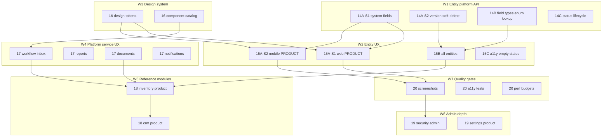

# Phase 16 — Standard product system (master roadmap)

**Status:** Planning complete — execution in `plan/17-standard-product-execution-playbook.md` — 2026-06-12  
**Audience:** Product, engineering, agents  
**Supersedes:** “Phase 12/13 = product complete” · pytest-only matrix **Done**

**Playbooks:** `17-standard-product-execution-playbook.md` (master index) · `14-entity-platform-baseline.md` · `15-entity-page-redesign.md` · `17-platform-services-product-ux.md` · `18-reference-modules-product.md` · `19-admin-product-depth.md` · `13-enterprise-admin-depth.md` (ABAC done; rest → P19)  
**Gate:** `plan/16-product-ready-dod.md` · `spec/sdd/07-product-readiness-matrix.md`  
**Feedback memory:** `docs/product/user-feedback-registry.md` (all user input — read before replanning)

---

## 1. What “standard product system” means

A stakeholder can demo **Inventory → Products** (then Warehouses, CRM) on **web and mobile** without apologizing for missing basics:

| Dimension | Standard bar | Not sufficient alone |
|-----------|------------|----------------------|
| **Data model** | Platform system fields, soft delete, version, status lifecycle, enum/lookup fields | CRUD API with 6 primitive field types |
| **Metadata** | One contract; system section injected; field types drive renderers | Metadata exists but UI ignores system attrs |
| **Entity UX** | **Separate list + record routes**; hero header on record page; loading/error/empty states on list | Wired grid + raw HTML form on one page |
| **Design** | Material 3 tokens, spacing, typography, light/dark, WCAG 2.2 AA targets | Material shell with ad-hoc CSS |
| **Platform services** | Workflow inbox, reports, docs, notifications at **Demo+** UX | Account-page demo buttons |
| **Admin** | Users/roles usable; settings grouped by domain; security readable | Toggle-heavy settings hub |
| **Quality** | pytest + contract tests + **screenshot + UX checklist** per surface | Green CI only |
| **Modules** | Reference modules meet **product** DoD, not API DoD | `inventory-definition-of-done.md` API checklist |

**Reference entity:** `PRODUCT` until Product-ready; then `WAREHOUSE`, `LEAD`, `CONTACT`.

---

## 2. Principles (feedback + best practices)

| Source | Applied as |
|--------|------------|
| **Salesforce / Dynamics platform fields** | `created_by`, `updated_by`, `created_at`, `updated_at`, version, soft delete |
| **SAP master-data patterns** | Status lifecycle, audit trail, searchable keys (SKU/code), inactive flag |
| **Material Design 3** | Color roles, elevation, shape, motion; component semantics (web + Flutter Material 3) |
| **WCAG 2.2 AA** | Focus order, labels, contrast, keyboard grid navigation |
| **ISO 25010** | Functional suitability + usability gates before “Product-ready” |
| **OWASP ASVS L1** | Auth on mutations, no system-field injection, field security honored in UI |
| **12-factor / API design** | Versioned metadata `schema_version`; optimistic concurrency on PUT |
| **Contract-first UI** | Same metadata drives Angular + Flutter; snapshot tests on fixtures |
| **EMCAP architecture** | Business in `modules/`; platform in `platform/api`; feature flags in YAML |

---

## 3. Dependency graph

**Execution order (critical path):**  
`14A-S1` → `15A-S1` + screenshots → `14A-S2` + `15A-S2` (mobile) → `16` design tokens → `15B` generalize → `17` service UX → `18` modules → `19` admin → `20` hard gates.

**Paused until PRODUCT Product-ready:** Phase 13 admin slices (ABAC editor depth, layout designer, isolation write).

---

## 4. Milestones

| Milestone | Exit criteria | Target phase |
|-----------|---------------|--------------|
| **M1 — PRODUCT web credible** | M1 checklist in §6 W2; 4 screenshots; `07` matrix Product-ready for PRODUCT web entity rows | 14A-S1 + 15A-S1 + P20-T01 |
| **M2 — PRODUCT mobile parity** | Mobile matches M1 UX bar; `metadata_contract_test` + flutter golden/screenshot | 15A-S2 + P14-T12 |
| **M3 — Entity platform complete** | Soft delete, version, enum/lookup, status in metadata + UI | 14A-S2 + 14B + 14C |
| **M4 — Inventory module product** | PRODUCT + WAREHOUSE Product-ready; module DoD v2 signed | 15B + 18A |
| **M5 — Standard platform demo** | M4 + workflow/report/doc/notif Demo+ + CRM LEAD/CONTACT Demo+ | 17 + 18B |
| **M6 — Enterprise admin credible** | Admin/settings Wired→Demo+; Phase 13 slices 2–3 | 19 |

---

## 5. Workstreams & tasks

Legend: **API** · **Web** · **Mobile** · **Doc/Test**

### W1 — Entity platform contract (Phase 14 extended)

| ID | Task | Layer | Depends | Status |
|----|------|-------|---------|--------|
| EMCAP-P14-T01–T08 | System fields + metadata injection | API, Web | — | Done (screenshots pending) |
| EMCAP-P14-T10 | `updated_by` on PUT; persist on row | API | T02 | Done |
| EMCAP-P14-T11 | `record_version` + `If-Match` / 409 on conflict | API | T10 | Done |
| EMCAP-P14-T12 | `deleted_at` soft delete; list excludes deleted; restore API | API | T10 | Done |
| EMCAP-P14-T13 | Metadata: map `active` → status chip contract | API | T01 | Pending |
| EMCAP-P14-T14 | Web/mobile honor soft delete (hide + restore action) | Web, Mobile | T12 | Partial |
| EMCAP-P14-T20 | `FieldType.ENUM` + options in `FieldDefinition` | API | T08 | Done |
| EMCAP-P14-T21 | `FieldType.LOOKUP` + `lookup_entity` ref | API | T20 | Done |
| EMCAP-P14-T22 | `FieldType.CURRENCY` / `TEXTAREA` | API | T20 | Done |
| EMCAP-P14-T23 | Metadata builder + validation for new types | API | T20–T22 | Done |
| EMCAP-P14-T24 | Web renderers: select, lookup picker, currency | Web | T23 | Done |
| EMCAP-P14-T25 | Mobile renderers: same types | Mobile | T23 | Done |
| EMCAP-P14-T26 | Contract fixtures per type | Doc/Test | T23 | Done |
| EMCAP-P14-T30 | Mobile system fields + datetime formatters | Mobile | T04 | Done |
| EMCAP-P14-T31 | `test_system_fields` mobile record display | Doc/Test | T30 | Done |

**Acceptance:** `pytest test_system_fields.py test_inventory_e2e.py`; web `npm run test:ci`; `flutter test test/metadata_contract_test.dart`.

---

### W2 — Entity page product UX (Phase 15 extended)

| ID | Task | Layer | Depends | Status |
|----|------|-------|---------|--------|
| EMCAP-P15-T01–T05 | Web PRODUCT hero, cards, grid polish | Web | P14-T05 | Done |
| EMCAP-P15-T06 | Screenshots + Product-ready gate for M1 | Doc/Test | T01–T05 | Pending |
| EMCAP-P15-T10 | Mobile `RecordDetailHeader` + section cards | Mobile | P14-T30, T01 | Done |
| EMCAP-P15-T11 | Mobile PRODUCT headline/subtitle util | Mobile | T10 | Done |
| EMCAP-P15-T12 | Mobile grid polish + datetime cells | Mobile | T10 | Done |
| EMCAP-P15-T13 | Mobile screenshots (M2) | Doc/Test | T10–T12 | Pending |
| EMCAP-P15-T20 | Generalize hero rules via metadata `display` hints | API, Web, Mobile | P14-T13, P16-T02 | Pending |
| EMCAP-P15-T21 | Apply redesign to WAREHOUSE, CRM entities | Web, Mobile | T20 | Pending |
| EMCAP-P15-T22 | Loading skeletons + error retry on entity page | Web, Mobile | T21 | Pending |
| EMCAP-P15-T23 | Empty grid state + “New record” CTA | Web, Mobile | T22 | Pending |
| EMCAP-P15-T30 | Keyboard nav grid (WCAG) | Web | T21 | Pending |
| EMCAP-P15-T31 | Screen reader labels on dynamic forms | Web, Mobile | T30 | Pending |
| EMCAP-P15-T32 | axe-core / accessibility CI job (web) | Doc/Test | T30–T31 | Pending |

**UX refs:** Material 3 lists & detail panels; WCAG 2.2 focus visible, label in name.

---

### W3 — Design system (Phase 16)

| ID | Task | Layer | Depends | Status |
|----|------|-------|---------|--------|
| EMCAP-P16-T01 | ADR: design tokens (spacing, radius, typography scale) | Doc | — | Done |
| EMCAP-P16-T02 | Web `styles/_tokens.scss` + CSS variables from theme service | Web | T01 | Pending |
| EMCAP-P16-T03 | Flutter `ThemeExtension` tokens aligned to web | Mobile | T01 | Pending |
| EMCAP-P16-T04 | Document component catalog in `docs/product/design-system.md` | Doc | T02–T03 | Done |
| EMCAP-P16-T05 | Standardize buttons, chips, cards across shell/entity/admin | Web | T02 | Pending |
| EMCAP-P16-T06 | Standardize buttons, chips, cards on mobile shell | Mobile | T03 | Pending |
| EMCAP-P16-T07 | Density: comfortable default + compact toggle | Web, Mobile | T05–T06 | Pending |
| EMCAP-P16-T08 | Dark mode contrast audit (≥4.5:1 body text) | Doc/Test | T02–T03 | Pending |

**Refs:** [Material Design 3](https://m3.material.io/) · Flutter Material 3 theming.

---

### W4 — Platform services product UX (Phase 17)

| ID | Task | Layer | Depends | Status |
|----|------|-------|---------|--------|
| EMCAP-P17-T01 | Workflow inbox: table/cards, SLA badges, empty state | Web | P16-T05 | Pending |
| EMCAP-P17-T02 | Workflow inbox mobile parity | Mobile | P16-T06, T01 | Pending |
| EMCAP-P17-T03 | Report run history + CSV download UX | Web, Mobile | P16 | Pending |
| EMCAP-P17-T04 | Dashboard widgets: visual KPI cards | Web, Mobile | P16 | Pending |
| EMCAP-P17-T05 | Notification center: read/unread, channel icons | Web, Mobile | P16 | Pending |
| EMCAP-P17-T06 | Document preview panel (not `alert`) + download | Web | P16 | Pending |
| EMCAP-P17-T07 | Document preview mobile (WebView / inline) | Mobile | T06 | Pending |
| EMCAP-P17-T08 | Account page → profile hub (not adapter test dump) | Web, Mobile | P16 | Pending |
| EMCAP-P17-T09 | Assistant UI polish when `ai.enabled` | Web, Mobile | P16 | Done (web) |
| EMCAP-P17-T10 | Service UX screenshot pack | Doc/Test | T01–T09 | Pending |

**Depends on:** APIs already **Done** in `04-capability-matrix.md` — this workstream is **presentation only**.

---

### W5 — Reference modules product depth (Phase 18)

| ID | Task | Layer | Depends | Status |
|----|------|-------|---------|--------|
| EMCAP-P18-T01 | `inventory-definition-of-done.md` v2 (product criteria) | Doc | M1 | Done |
| EMCAP-P18-T02 | PRODUCT seed data: realistic catalog (20+ rows) | API, Doc | — | Done |
| EMCAP-P18-T03 | WAREHOUSE entity Product-ready (web + mobile) | Web, Mobile | P15-T21 | Pending |
| EMCAP-P18-T04 | STOCK_ADJUSTMENT workflow visible on PRODUCT detail | Web, Mobile | P17-T01 | Pending |
| EMCAP-P18-T05 | LOW_STOCK / INVENTORY_VALUATION report UX from module menus | Web, Mobile | P17-T03 | Pending |
| EMCAP-P18-T06 | CRM module product DoD + LEAD/CONTACT redesign | All | P15-T21 | Pending |
| EMCAP-P18-T07 | Module menu icons + descriptions in metadata | API, Web, Mobile | P16 | Pending |
| EMCAP-P18-T08 | E2E: inventory product smoke script | Doc/Test | T03–T05 | Pending |

---

### W6 — Admin & settings product depth (Phase 19 = resumed Phase 13)

**Start after M1 (PRODUCT web Product-ready).**

| ID | Task | Layer | Depends | Status |
|----|------|-------|---------|--------|
| EMCAP-P19-T01 | Settings IA: domains (Identity, Security, Platform, Modules) | Web, Mobile | M1 | Pending |
| EMCAP-P19-T02 | Admin users/roles: table UX, validation messages | Web, Mobile | P16 | Pending |
| EMCAP-P19-T03 | P13-T10–T14 field `read_roles` override UI | API, Web, Mobile | P19-T02 | Pending |
| EMCAP-P19-T04 | ABAC editor UX review + validation (P13 done → polish) | Web, Mobile | P19-T01 | Pending |
| EMCAP-P19-T05 | Branding admin: live theme preview | Web | P16-T02 | Pending |
| EMCAP-P19-T06 | Document platform settings UI (P12C-T12) | Web, Mobile | P19-T01 | Partial — web read-only Platform tab |
| EMCAP-P19-T07 | P13-T20–T22 isolation write (ops only) | API, Doc | P19-T01 | Pending |
| EMCAP-P19-T08 | Layout designer ADR (P13-T30) — no UI until entity platform complete | Doc | M3 | Pending |

---

### W7 — Quality, contract & release gates (Phase 20)

| ID | Task | Layer | Depends | Status |
|----|------|-------|---------|--------|
| EMCAP-P20-T01 | Screenshot folder + naming convention | Doc | — | Done |
| EMCAP-P20-T02 | M1 screenshot capture (PRODUCT web) | Doc | P15-T06 | Pending |
| EMCAP-P20-T03 | M2 screenshot capture (PRODUCT mobile) | Doc | P15-T13 | Pending |
| EMCAP-P20-T04 | Expand `REQUIRED_METHODS` when new admin routes added | Doc/Test | — | Pending |
| EMCAP-P20-T05 | Metadata snapshot CI for all reference entities | Doc/Test | P14-T26 | Pending |
| EMCAP-P20-T06 | Web bundle budget plan post-M3 (split lazy routes) | Web, Doc | P16 | Pending |
| EMCAP-P20-T07 | Performance: entity list <200ms p95 local; document | Doc/Test | P15-T22 | Pending |
| EMCAP-P20-T08 | `07-product-readiness-matrix.md` rev per milestone | Doc | M1–M6 | Ongoing |

---

### W8 — Infrastructure & ops (non-blocking for M1–M5)

| ID | Task | Layer | Depends | Status |
|----|------|-------|---------|--------|
| EMCAP-P21-T01 | PostgreSQL migration for `created_by` / soft delete columns | Infra | P14-T12 | Pending |
| EMCAP-P21-T02 | Seed script documents product demo path | Doc | P18-T02 | Done |
| EMCAP-P21-T03 | `known-pitfalls.md` Phase 16 section | Doc | — | Done |

---

## 6. Layer ownership summary

| Layer | Path | W1–W8 focus |
|-------|------|-------------|
| **Platform API** | `platform/api/src/emcap/` | System fields, field types, metadata, soft delete, admin security |
| **Modules** | `modules/*` | Richer field defs, seed data, module DoD v2 |
| **Web** | `clients/web/src/app/` | Entity UX, design system, service pages, admin |
| **Mobile** | `clients/mobile/lib/` | Parity with web per workstream |
| **Config** | `config/platform.yaml` | Feature flags only — no hard-coded UI |
| **Spec/Docs** | `spec/sdd/`, `plan/`, `docs/product/` | Matrices, screenshots, ADRs |
| **CI** | `.github/workflows/` | pytest, vitest, flutter, a11y, coverage |

---

## 7. Traceability

| Requirement | Workstreams |
|-------------|-------------|
| FR-006 | W1, W5 |
| FR-007, FR-008, FR-008c | W1, W2, W3 |
| FR-008d | W2, W3, W6 |
| FR-009–FR-013 | W4, W5 |
| FR-017 | W1, W5 |
| FR-018, FR-019 | W5 |
| NFR-004, NFR-013 | W7 |
| NFR-005 | W1, W6 |

Update `spec/sdd/03-traceability-matrix.md` when each milestone closes.

---

## 8. What we are explicitly not doing (yet)

- Runtime module hot-install (SDD §27 deploy via config + manifest)
- PCI payment capture UI
- Full layout designer UI (ADR only until M3)
- In-app Grafana embedding
- New business modules beyond inventory + CRM reference

---

## 9. Immediate next actions (agent / dev)

See sprint **S1–S2** in `plan/17-standard-product-execution-playbook.md` §4.

1. **P15-T06** + **P20-T02** — PRODUCT web screenshots → **M1** (no new features)  
2. **P15-T13** + **P20-T03** — mobile screenshots → **M2**  
3. **P16-T02–T03** — design tokens before P17/P19 polish  
4. **P14-T13–T14, T21–T26** — lookup + status contract → **M3**  

**Do not** expand Phase 19 admin until M1 is signed in `07-product-readiness-matrix.md`.

---

## 10. Feedback crosswalk (all user input → this plan)

Canonical list: **`docs/product/user-feedback-registry.md`** (memorize; update when new feedback).

### Coverage verdict

| Question | Answer |
|----------|--------|
| **Whole system planned?** | **Yes** for standard product path: API · web · mobile · modules · docs · CI gates, via W1–W8 + milestones M1–M6. |
| **Every SDD § at Product-ready?** | **No** — explicit §8 out-of-scope until post-M5; API “Done” in `04-capability-matrix` ≠ product bar. |
| **All earlier feedback addressed?** | **Mapped** — see registry §A–D; **gap tasks** §I. |
| **Admin toggles deprioritized?** | **Yes** — P19 after M1; ABAC polish not new features. |

### Feedback gap tasks (registry §I)

| ID | Task | Layer | Depends |
|----|------|-------|---------|
| EMCAP-P15-T14 | Mobile SSE grid refresh when `grid.realtime` | Mobile | P15-T12 |
| EMCAP-P16-T09 | Shell breadcrumbs + nav polish | Web, Mobile | P16-T05 |
| EMCAP-P17-T11 | Rule evaluate UX (formula demo → product panel) | Web, Mobile | P17-T08 |
| EMCAP-P19-T09 | Settings DB overrides + reload behavior documented in UI | Web, Mobile | P19-T01 |
| EMCAP-P19-T10 | Integrations product UX (settings-led, not Account) | Web, Mobile | P19-T01 |
| EMCAP-P19-T11 | Payments product UX when `payments.enabled` | Web, Mobile | P19-T01 |
| EMCAP-P19-T12 | SMS/push channel template product bar | Web, Mobile | P19-T01 |

### Matrix honesty (feedback C6, C10)

| Matrix | Measures | Do not use for product sign-off |
|--------|----------|--------------------------------|
| `04-capability-matrix` | Platform API / infra wired | End-user quality |
| `05-end-user-matrix` | CRUD/renderer wiring | Professional UX |
| `06-admin-product-ui-matrix` | Admin shell existence | Enterprise admin product |
| **`07-product-readiness-matrix`** | **Product-ready** | — |

Backlog **Done** = implementation complete; **Product-ready** = `16-product-ready-dod.md` only.
