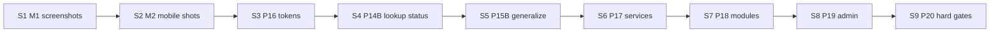

# Standard product — complete execution playbook

**Status:** Planning complete — 2026-06-12  
**Audience:** Product, engineering, agents  
**Parent:** `plan/16-standard-product-system.md` (roadmap) · **Gate:** `plan/16-product-ready-dod.md`  
**Feedback:** `docs/product/user-feedback-registry.md` (read before any product work)

This document is the **single execution index** for closing standard product gaps across API, web, mobile, modules, docs, and CI. Implementation order follows §4; slice cards in §5–§12 hold acceptance criteria.

**Phase playbooks (detail):**

| Phase | Playbook |
|-------|----------|
| 14 Entity platform | `plan/14-entity-platform-baseline.md` |
| 15 Entity UX | `plan/15-entity-page-redesign.md` |
| 16 Design system | `spec/sdd/adrs/006-design-tokens-material3.md`, `docs/product/design-system.md` |
| 17 Platform services UX | `plan/17-platform-services-product-ux.md` |
| 18 Reference modules | `plan/18-reference-modules-product.md` |
| 19 Admin depth | `plan/19-admin-product-depth.md` |

---

## 1. Current state snapshot

| Dimension | Status | Evidence |
|-----------|--------|----------|
| Platform API wired (04 matrix) | **Mostly Done** | `spec/sdd/04-capability-matrix.md` |
| CRUD/renderer wiring (05 matrix) | **Done** | Phase 8 closed |
| **Product readiness (07 matrix)** | **Early** — mostly Wired/Demo | Screenshots pending |
| Backlog implementation | **~78%** task Done (253/326) | `plan/03-task-backlog.md` |
| Reference entity PRODUCT (web) | **Product-ready (M1 signed)** | Screenshot pack in `docs/product/screenshots/` |
| Reference entity PRODUCT (mobile) | Code **Demo**; M2 not signed | Parity code landed 2026-06-12 |
| Entity platform API | **14A-S2 Done** (version, soft delete, enum) | `test_system_fields.py` |
| Design tokens | ADR + stub catalog; **not** in SCSS/Flutter | P16-T02–T03 pending |
| Platform service pages | **Demo+** — shell nav pages (workflow, reports, dashboards, notifications); **P17 Done** | `pages/workflow`, `reports`, `dashboards`, `notifications` |
| Admin/settings | **Partial/Demo** — users/roles/field security Done; ABAC preview Partial | P19-T01–T03 Done; `admin-security.component` |
| Field security (metadata + record) | **Done** — filter form/grid + web defense in depth | P23-T01/T02; `metadata/security.py`, `field-security.util.ts` |
| Inventory module | API DoD v1; **M4 web signed**; W5 stock movements Done | `inventory-definition-of-done-v2.md`, `plan/20-standard-entity-rollout.md` §1.5 |

**Honesty rule (feedback C6, C10, A12):** Backlog **Done** ≠ **Product-ready**. Only `07-product-readiness-matrix.md` + `16-product-ready-dod.md` sign-off.

---

## 2. Principles (feedback + standards)

| Source | Rule in execution |
|--------|-------------------|
| EMCAP core standards | Business in `modules/`; platform contract in `platform/api`; flags in `config/platform.yaml` |
| Feedback A7 | No git commit before user review |
| Feedback A13 | Minimal diffs; match surrounding conventions |
| Salesforce/Dynamics | System fields, audit, version, soft delete |
| SAP master data | Status lifecycle, searchable keys, inactive flag |
| Material Design 3 | Tokens, elevation, component semantics (web + Flutter) |
| WCAG 2.2 AA | Focus, labels, contrast, keyboard grid (P15-T30–T32) |
| ISO 25010 | Usability gate before Product-ready |
| OWASP ASVS L1 | Auth on mutations; reject system-field injection |
| Contract-first UI | Same metadata → Angular + Flutter; fixture snapshots |
| 12-factor API | `schema_version`; optimistic concurrency (`If-Match`) |

---

## 3. Milestones & exit criteria

| ID | Name | Exit criteria (all required) | Blocks |
|----|------|------------------------------|--------|
| **M1** | PRODUCT web credible | M1 screenshot pack (4 images); `07` §9 rows Demo→Product-ready; `16-product-ready-dod` §5 | P19, W4 depth |
| **M2** | PRODUCT mobile parity | Mobile screenshot; flutter metadata test; `07` mobile §8–§9 | M4 sign-off |
| **M3** | Entity platform complete | Lookup + status metadata; soft-delete UI complete; P14-T26 fixtures | Layout designer UI |
| **M4** | Inventory product | PRODUCT + WAREHOUSE Product-ready; inventory DoD v2 signed | M5 |
| **M5** | Standard platform demo | P17 service pages Demo+; CRM LEAD/CONTACT Demo+; P18 smoke green | M6 |
| **M6** | Enterprise admin credible | P19 settings IA + users/roles Demo+; Phase 12 partial closed | — |

---

## 4. Critical path & sprint sequence



| Sprint | Focus | Tasks | Milestone |
|--------|-------|-------|-----------|
| **S1** | Close M1 gate (no new features) | P15-T06, P20-T02; manual UX checklist | **M1** ✓ 2026-06-13 |
| **S2** | Mobile evidence + SSE | P15-T13, P15-T14; mobile restore if missing | **M2** |
| **S3** | Design foundation | P16-T02–T03, P16-T05–T06, P16-T09 | — |
| **S4** | Entity platform depth | P14-T13, P14-T14, P14-T21–T26 | **M3** partial |
| **S5** | Entity UX depth | P15-T20–T23, P15-T22 empty/loading | — |
| **S6** | A11y + perf | P15-T30–T32, P20-T06–T07 | — |
| **S7** | Service UX web | P17-T01, T03–T06, T08, T11 | — |
| **S8** | Service UX mobile + shots | P17-T02, T07, T09, T10 | — |
| **S9** | Inventory product | P15-T21 WAREHOUSE, P18-T03–T05, T08 | **M4** |
| **S10** | CRM reference | P18-T06, P18-T07 | — |
| **S11** | Admin IA + users | P19-T01–T02, T09 | **M6** start |
| **S12** | Admin security + integrations | P19-T03–T04, T10–T12, P13-T10 | **M6** |
| **S13** | Admin ops + docs | P19-T05–T07, P12C-T12, P19-T06 | **M6** |
| **S14** | Quality hardening | P20-T04–T05, P21-T01 PG migrations | — |
| **S15** | Layout ADR only | P19-T08 / P13-T30 | post-M3 |

**Paused until M1:** Phase 13 admin expansion beyond ABAC (field overrides API → S12).

---

## 5. Slice card — 14A-S2 (version, soft delete) — **Done**

| Field | Value |
|-------|-------|
| Tasks | P14-T10, T11, T12 |
| Layer | API, Web (partial restore) |
| Tests | `test_system_fields.py`; `test_inventory_e2e.py` (DELETE 200, 11 grid cols) |

**Remaining:** P14-T14 mobile restore UI; P21-T01 PostgreSQL migrations.

---

## 6. Slice card — 14B (field types + status)

### 14B-S1 — ENUM — **Done**

| Tasks | P14-T20, web select in `dynamic-form-view` |
| Tests | Enum in PRODUCT `active` or module field defs |

### 14B-S2 — Lookup, currency, textarea — **Partial** (P14-T21–T25 Done)

| ID | Work | Acceptance |
|----|------|------------|
| P14-T21 | `FieldType.LOOKUP`, `lookup_entity` on `FieldDefinition` | **Done** — pytest: metadata includes lookup ref |
| P14-T22 | `CURRENCY`, `TEXTAREA` types | **Done** — pytest: `test_product_currency_and_textarea_field_metadata` |
| P14-T23 | Builder + validation for T21–T22 | **Done** — `metadata/validation.py`; registry startup + builder guard |
| P14-T24 | Web: lookup picker modal, currency input, textarea | **Done** — Karma: lookup/currency/field-display specs |
| P14-T25 | Mobile: same renderers | **Done** — `LookupField`, `CurrencyField`, `TextareaField`; unit tests |
| P14-T26 | Fixtures per type in `tests/fixtures/metadata/` | CI snapshot job P20-T05 |

### 14C — Status chip contract — **Pending**

| ID | Work | Acceptance |
|----|------|------------|
| P14-T13 | Metadata `display.status_field` + chip variant (`active`→success/warning) | Web/mobile read contract; not hard-coded PRODUCT only |
| P14-T14 | Soft delete + restore UI complete | Web Done; mobile restore button + i18n |

**Paths:** `metadata/builder.py`, `modules/inventory/module.py`, entity renderers.

---

## 7. Slice card — 15A (PRODUCT reference UX)

### 15A-S1 web — **Done** (gate open)

| Tasks | P15-T01–T05 Done; **P15-T06 Pending** |
| Screenshots | `phase15-product-grid-polish.png`, `phase15-product-detail-hero.png`, `phase14-product-detail-system-card.png`, dark variant |

### 15A-S2 mobile — **Code Done; gate Pending**

| Tasks | P15-T10–T12 Done; **P15-T13 Pending** |
| Screenshot | `phase15-mobile-product-detail.png` |

### 15B — Generalize + states — **Pending**

| ID | UX bar |
|----|--------|
| P15-T20 | Hero/subtitle from metadata `display` hints (depends P14-T13, P16-T02) |
| P15-T21 | WAREHOUSE, LEAD, CONTACT same pattern |
| P15-T22 | Skeleton loaders; error banner + retry |
| P15-T23 | Empty grid illustration + “New record” CTA |
| P15-T14 | Mobile SSE grid refresh (`grid.realtime`) |

### 15C — Accessibility — **Pending**

| ID | Bar |
|----|-----|
| P15-T30 | Keyboard row focus in grid |
| P15-T31 | `aria-label` on dynamic fields |
| P15-T32 | axe-core in CI (web) |

---

## 8. Slice card — W3 design system (P16)

| ID | Deliverable | Done when |
|----|-------------|-----------|
| P16-T01 | ADR-006 | **Done** |
| P16-T02 | `styles/_tokens.scss` + theme CSS variables | Shell + entity use tokens, not ad-hoc px |
| P16-T03 | Flutter `ThemeExtension` | Mobile shell matches web spacing scale |
| P16-T04 | `design-system.md` catalog | **Done** (expand as components land) |
| P16-T05–T06 | Buttons, chips, cards standardized | Same class names / widget patterns |
| P16-T07 | Density toggle | Comfortable default; compact optional |
| P16-T08 | Dark contrast audit doc | ≥4.5:1 body; fix failures |
| P16-T09 | Breadcrumbs + nav polish | Feedback B1; module group headers |

---

## 9. Slice card — W4 platform services (P17)

See **`plan/17-platform-services-product-ux.md`** for per-page specs.

**Account page today (must change):** `account.component.ts` exposes integrations, rules, payments, metrics — **move to settings/profile**, not end-user Account.

| Page | Current | Target (Demo+) |
|------|---------|----------------|
| Workflow inbox | Raw HTML table | Cards/table, SLA badges, empty state, filter |
| Reports | Basic list | Run history, CSV download, status |
| Dashboards | List widgets | KPI cards, chart placeholders |
| Notifications | List | Read/unread, channel icons |
| Documents | `alert()` preview | Inline panel + download |
| Account | Dev dump | Profile hub: MFA, roles read-only, locale/theme |
| Assistant | Basic chat | Polished when `ai.enabled` |
| Rules | On Account | P17-T11 evaluate panel in admin or tools |

---

## 10. Slice card — W5 reference modules (P18)

See **`plan/18-reference-modules-product.md`**.

| ID | Deliverable |
|----|-------------|
| P18-T01 | Inventory DoD v2 — **Done** |
| P18-T02 | 20+ PRODUCT seed — **Done** |
| P18-T03 | WAREHOUSE Product-ready |
| P18-T04 | STOCK_ADJUSTMENT visible on PRODUCT detail |
| P18-T05 | LOW_STOCK / valuation report UX from module menus |
| P18-T06 | CRM LEAD/CONTACT product |
| P18-T07 | Menu icons in module metadata |
| P18-T08 | `scripts/` inventory product smoke |
| — | **W5** stock movement types + entities (post-M4) | `plan/20-standard-entity-rollout.md` · P20-T17–T19 |

---

## 11. Slice card — W6 admin (P19 + Phase 12 partial)

See **`plan/19-admin-product-depth.md`**.

**Start after M1.** Maps Phase 12 **Partial** items to P19:

| Phase 12 item | P19 / P13 task |
|---------------|----------------|
| P12B-T09 Auth provider UI | P19-T01 domain Identity |
| P12C-T02 Settings hub | P19-T01 IA |
| P12C-T07 Branding | P19-T05 live preview |
| P12C-T12 Document settings | P19-T06 |
| P12C-T16 SMS/push | P19-T12 |
| P12C-T19 Security section | P19-T01 + P19-T04 |
| P12D-T05 Mobile settings | P19-T01 parity |

---

## 12. Slice card — W7 quality (P20) + W8 infra (P21)

| ID | Work |
|----|------|
| P20-T01 | Screenshot convention — **Done** |
| P20-T02–T03 | M1/M2 captures |
| P20-T04 | `REQUIRED_METHODS` sync when admin routes added |
| P20-T05 | Metadata snapshot CI all reference entities |
| P20-T06 | Lazy routes plan (bundle budget) |
| P20-T07 | Entity list p95 <200ms local doc |
| P20-T08 | Rev `07` per milestone — **Ongoing** |
| P21-T01 | PG migrations for system columns |
| P21-T02 | Demo runbook — **Done** |
| P21-T03 | Pitfalls Phase 16 — **Done** |

---

## 13. Feedback registry coverage (§A–J)

| Section | Covered in execution |
|---------|---------------------|
| A Standing orders | §2 principles; agent checklist §15 |
| B Phase 12 (16 items) | §11 partial map; P19 playbook |
| C Product pivot C1–C13 | W1–W8; milestones M1–M6 |
| D SDD questions | `16-standard-product-system.md` §8 out-of-scope |
| E Local dev | `plan/11-local-dev-tooling.md`; runbook |
| F Pitfalls | `known-pitfalls.md`; regression tests per fix |
| G Services map | P17 playbook + §9 |
| H Gap tasks | P15-T14, P16-T09, P17-T11, P19-T09–T12 |
| I Scope boundaries | Not in S1–S14 unless noted |
| J Agent checklist | §15 |

---

## 14. SDD § crosswalk (standard product v1)

| SDD § | Standard product v1 target | Sprint |
|-------|------------------|--------|
| §2 Platform services | Demo+ presentation (API Done) | S7–S8 |
| §6–§9 UI / entities | Product-ready PRODUCT + WAREHOUSE | S1–S6, S9 |
| §7 Identity admin | Wired→Demo+ users/roles | S11–S12 |
| §9 Layout designer | ADR only | S15 |
| §10–§20 Settings | Domain IA + polish | S11–S13 |
| §26–§27 Modules | Inventory + CRM reference | S9–S10 |
| §30 Module DoD | Product v2 sign-off | S9 |

---

## 15. Risk register

| Risk | Mitigation |
|------|------------|
| Screenshot gate blocks M1 indefinitely | S1 is manual-only; runbook + demo seed |
| Stale API after platform changes | Restart uvicorn; pitfalls doc |
| Mobile/web drift | Contract fixtures P14-T26, P20-T05 |
| Bundle budget fails CI | P20-T06 lazy routes before adding charts |
| Admin scope creep | P19 only after M1; no new toggles on critical path |
| AI-generated UI churn | A13: minimal diffs; reuse `shared/` |

---

## 16. Verification commands (per milestone)

```bat
REM M1
cd platform\api && python -m pytest tests/test_system_fields.py tests/test_inventory_e2e.py -q
cd clients\web && npm run lint && npm run test:ci && npm run build

REM M2
cd clients\mobile && flutter test

REM M4
python scripts\verify-platform-core.ps1
REM + inventory smoke when P18-T08 lands

REM M6
cd platform\api && python -m pytest tests/test_admin_api.py -q
```

Manual: `scripts\run-emcap.bat --stack-only --local` → Inventory → Products → capture screenshots.

---

## 17. Agent session checklist

1. Read `codebase-index.md` → `user-feedback-registry.md` → this playbook §4 sprint order  
2. Pick **one slice**; do not mix M1 screenshots with P19 admin  
3. `known-pitfalls.md` before debugging  
4. Tests + lint before claiming Done  
5. Update `07-product-readiness-matrix.md` only for Product-ready claims  
6. Sync backlog row + traceability if API changes  
7. **No commit** unless user asks (A7)  
8. New feedback → registry + backlog task ID

---

## 18. Explicit out of scope (standard product v1)

Same as `16-standard-product-system.md` §8 + registry §I: hot-install, PCI capture, layout designer UI, Grafana embed, new modules beyond inventory/CRM, multi-region SLA proof.
