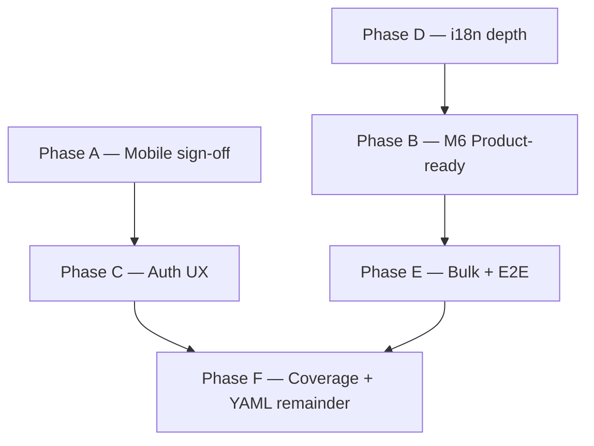

# EMCAP — Standard professional application gap plan

**Status:** Accepted — 2026-06-16  
**Audience:** Product, engineering, agents  
**Parent:** `plan/17-standard-product-execution-playbook.md` · **Gate:** `plan/16-product-ready-dod.md` · `spec/sdd/07-product-readiness-matrix.md`  
**Feedback:** `docs/product/user-feedback-registry.md` (read before any product work)

This document is the **gap analysis and prioritized roadmap** for elevating EMCAP from “backlog Done / matrix Demo” to a **standard professional multi-tenant application** across API, web, mobile, admin, and quality gates.

**Honesty rule (A12, C6, C10):** Backlog **Done** ≠ **Product-ready**. Matrix **07** + DoD checklist + screenshot evidence are the product gate.

---

## 1. Executive summary

| Dimension | Today (2026-06-16) | Professional bar | Gap severity |
|-----------|-------------------|------------------|--------------|
| **API coverage** | ~91% total pytest; CI `--cov-fail-under=80` green | 80% total + critical per-file | **Low** — ratchet stragglers only |
| **Web coverage** | Karma **406 specs**; branches **~80.5%** (Sprint 14) | 80% lines/branches in CI | **Low** — maintain ratchet |
| **Mobile coverage** | Dart contract/widget tests; CI gate scripted | 80% Flutter coverage in CI | **Medium** — gate not locally verified |
| **M1/M4 web reference** | **Signed** | Signed | **None** |
| **M2 mobile parity** | Code Demo+; **no device PNG** | Product-ready + screenshot | **Critical** |
| **M3 entity platform** | API Done; web Demo+; mobile Demo | Product-ready all clients | **High** |
| **M5 platform + CRM** | Web Product-ready; CRM mobile Demo+ | Mobile Product-ready | **High** |
| **M6 admin/settings** | P19 backlog Done; matrix still **Demo** | Product-ready + admin pack PNGs | **Critical** |
| **Enterprise auth UX** | API Done; login/account functional | Provider picker, MFA enroll flow, session UX polish | **High** |
| **i18n depth** | Shell + workflow states localized | Page bodies EN/FR/BN on all primary surfaces | **High** |
| **Bulk actions / E2E** | Single-record CRUD strong | Grid bulk select/export/delete; Playwright smoke in CI | **High** |
| **Operate without YAML** | Core admin editable | Grid flags, AI backend, observability still partial | **Medium** |

**Net-new work:** **14 tasks** `EMCAP-P18-T09` … `EMCAP-P18-T22` (Phase 18B extension). Existing P18-T01–T08 remain Done/Partial as documented in `plan/03-task-backlog.md`.

**Top five gaps (priority order):**

1. **M2 mobile parity** — PRODUCT mobile Product-ready sign-off blocked on Flutter device PNG (`P15-T13`, `P20-T03`, `P18-T09`).
2. **M6 admin Demo → Product-ready** — users/roles/settings rows need DoD + screenshot pack (`P18-T15`, `P18-T21`).
3. **Enterprise auth UX** — OAuth provider selection, MFA enrollment clarity, account security panel (`P18-T11`).
4. **i18n depth** — entity pages, admin, settings body copy beyond shell chrome (`P18-T12`).
5. **Bulk actions + E2E** — grid multi-select operations and CI Playwright smoke (`P18-T13`, `P18-T14`).

---

## 2. Current state (evidence)

### 2.1 Backlog vs product gate

| Metric | Value | Source |
|--------|-------|--------|
| Backlog Done | **296 / 330** | `plan/03-task-backlog.md` progress table |
| Backlog Partial | **4** (P15-T13, P18-T06, P20-T03, + 1) | Same |
| Matrix 07 milestones | M1/M4 **Signed**; M2 **Open**; M3/M5/M6 **Partial** | `spec/sdd/07-product-readiness-matrix.md` |
| Phase 12 backlog | **67/67 Done** | Reconciled with P19; product gate separate |
| Phase 19 backlog | **12/12 Done** | Implementation Done; M6 still Demo in matrix |

### 2.2 Coverage gates (NFR-003 / NFR-004)

| Layer | Gate | Status |
|-------|------|--------|
| API pytest total | `--cov-fail-under=80` | **Pass (~91%)** |
| API per-file | workflow, rules, oauth, rbac stragglers | **Partial** |
| Web Karma | branches 80% in `karma.conf.js` | **Pass (~80.5%)** |
| Mobile Flutter | `scripts/check-flutter-coverage.py --min 80` | **Wired in CI**; local SDK often absent |

### 2.3 What is already strong

- Separate list/record entity routes (Slice 15C) web + mobile
- Metadata-driven forms/grids with field security (`metadata/security.py`)
- Platform service pages (workflow, reports, dashboards, notifications) web Product-ready
- Admin CRUD: users, roles, field access, ABAC, layout editor, isolation ops
- Settings IA: modules, identity, platform, integrations with editable document/workflow/report slices (Sprint 12)
- Inventory reference: WAREHOUSE + STOCK_MOVEMENT web Product-ready; W5 movement posting

### 2.4 What blocks “standard professional app”

| Category | Symptom | Matrix / backlog |
|----------|---------|------------------|
| Mobile evidence | No M2/CRM device PNGs | M2 Open; P15-T13, P20-T03, P18-T06 Partial |
| Admin polish | Screenshots exist but rows stay Demo | M6 Partial; §12 admin table |
| Auth UX | Functional but not enterprise-demo quality | §7 Identity Partial |
| i18n | Shell localized; page bodies English-heavy | §6 App UI i18n Demo |
| Grid ops | No bulk delete/export selection | Not in SDD v1 backlog |
| E2E | pytest module smokes; no Playwright CI gate | P18-T08 inventory smoke only |
| YAML-only knobs | AI provider, some observability | §10 Operate without YAML Partial |

---

## 3. Gap analysis by workstream

### 3.1 Mobile parity (M2, M3, M5)

| Gap | API | Web | Mobile | Task |
|-----|-----|-----|--------|------|
| PRODUCT reference parity | Done | Product-ready | Demo+ code, no PNG | **P18-T09** |
| CRM LEAD/CONTACT sign-off | Done | Product-ready | Demo+ contracts | **P18-T10** |
| Entity platform field types | Done | Demo | Demo | **P18-T16** |
| STOCK_MOVEMENT + lines | Done | Product-ready | Demo | **P18-T17** |
| Document preview | Done | Demo | Partial tests | **P18-T18** |
| Layout editor + field access | Done | Demo | Demo code | Covered by M2/M6 |

**Exit:** M2 **Signed** in matrix 07; §8–§9 mobile rows ≥ Demo with PNG where required.

### 3.2 Admin & settings (M6)

| Gap | Current | Target | Task |
|-----|---------|--------|------|
| Users/roles UX bar | Demo + PNG | Product-ready DoD | **P18-T21** |
| Settings hub elevation | Demo; editable slices landed | Product-ready batch | **P18-T15** |
| Branding/doc/isolation PNG refresh | Partial captures | Full M6 pack in README | **P18-T15** |
| ABAC / integrations “Wired” rows | Functional | Demo+ with screenshot | **P18-T21** |

**Exit:** M6 milestone **Signed** or honest **Product-ready** on §12 rows.

### 3.3 Enterprise auth UX

| Gap | Current | Target | Task |
|-----|---------|--------|------|
| OAuth provider picker | Config-driven; minimal UX | Provider cards, error states, i18n | **P18-T11** |
| MFA enrollment | API Done | Step-by-step account UX + mobile mirror | **P18-T11** |
| Session / tenant switch | Works | Clear tenant context on login | **P18-T11** |
| Permission-filtered menus | Partial | Viewer role demo path documented | **P18-T11** |

**Exit:** `06-admin-product-ui-matrix.md` §7 Identity rows ≥ Demo; FR-001 traceability updated.

### 3.4 Internationalization depth

| Gap | Current | Target | Task |
|-----|---------|--------|------|
| Entity list/record copy | Mostly EN | FR/BN keys on labels, errors, empty states | **P18-T12** |
| Admin pages | Partial | users/roles/security i18n complete | **P18-T12** |
| Settings tabs | Partial | All tab labels + field hints localized | **P18-T12** |
| Mobile parity | Shell done | Match web key set | **P18-T12** |

**Exit:** `06` §6 App UI i18n → **Demo+** with BN sample on ≥3 primary pages.

### 3.5 Bulk actions & E2E quality

| Gap | Current | Target | Task |
|-----|---------|--------|------|
| Grid bulk select | None | Checkbox column + bulk delete (soft) + export selected | **P18-T13** |
| Playwright CI smoke | Screenshot scripts only | Login → entity CRUD → settings save in CI (optional nightly) | **P18-T14** |
| Module inventory smoke | `test_inventory_product_smoke.py` | Extend to CRM LEAD path | **P18-T14** |
| Mobile bulk | N/A v1 | Document deferral | — |

**Exit:** Bulk actions on PRODUCT grid web; E2E script documented in `docs/dev/recipes/` + green on local stack.

### 3.6 Platform depth & optional surfaces

| Gap | Task |
|-----|------|
| Assistant / rule evaluate Product-ready bar | **P18-T19** (flag-gated) |
| Grid realtime/offline mobile parity | **P18-T20** |
| AI provider / observability settings UI | **P18-T22** |
| Flutter coverage local verify | **P18-T09** dependency |

---

## 4. Net-new tasks (Phase 18B)

Stable IDs for tracking. Add to `plan/03-task-backlog.md` when implementation starts (not in this planning-only change).

| ID | Task | Depends | Layer | Acceptance (summary) |
|----|------|---------|-------|----------------------|
| **EMCAP-P18-T09** | M2 PRODUCT mobile Product-ready sign-off | P15-T13, P20-T03 | Mobile, Doc | Device PNG; matrix M2 **Signed**; `16-product-ready-dod` §4 mobile |
| **EMCAP-P18-T10** | CRM mobile LEAD/CONTACT Product-ready | P18-T06, P18-T09 | Mobile, Doc | CRM PNG pack; §17 mobile rows Product-ready |
| **EMCAP-P18-T11** | Enterprise auth UX (OAuth, MFA, account) | P19-T02 | Web, Mobile | Provider picker + MFA steps + i18n; Karma/Dart specs |
| **EMCAP-P18-T12** | App i18n depth (entity, admin, settings bodies) | P16 shell i18n | Web, Mobile | FR/BN keys; matrix §6 elevation |
| **EMCAP-P18-T13** | Grid bulk actions (select, export, soft-delete) | P14 entity platform | API, Web | Metadata flag or entity option; pytest + Karma |
| **EMCAP-P18-T14** | Playwright E2E smoke + CI hook | Local stack recipe | Web, CI | `scripts/e2e-smoke.mjs`; login→PRODUCT CRUD→settings |
| **EMCAP-P18-T15** | M6 admin/settings Product-ready screenshot batch | P19-T01–T12 | Web, Doc | Refresh branding/doc/isolation/users PNGs; matrix §12 |
| **EMCAP-P18-T16** | Mobile entity platform Product-ready (lookup, status, soft delete) | P18-T09 | Mobile | Field-type UX + PNG; §8 mobile rows |
| **EMCAP-P18-T17** | STOCK_MOVEMENT mobile Product-ready | P20-T18, P18-T09 | Mobile | Movement grid/detail PNG; post flow visible |
| **EMCAP-P18-T18** | Document preview mobile Product-ready | P17-T06 | Mobile | Device verify + `document_preview_util_test.dart` depth |
| **EMCAP-P18-T19** | Assistant + rule-evaluate product bar | P17-T09, P17-T11 | Web | Demo+ when `ai.enabled`; screenshot optional |
| **EMCAP-P18-T20** | Grid realtime/offline mobile parity | P15-T14 | Mobile | SSE refresh UX + contract tests |
| **EMCAP-P18-T21** | Admin users/roles/security Product-ready elevation | P18-T15 | Web, Doc | DoD checklist; matrix §7/§12 Demo→Product-ready |
| **EMCAP-P18-T22** | Remaining YAML-only settings (AI backend, observability) | P19-T01 | API, Web | Editable or honest read-only + runbook links |

**Count:** 14 net-new tasks (P18-T09 … P18-T22).

---

## 5. Prioritized roadmap — Phases A–F

Phases are **sequenced for dependency and ROI**. Parallelize B+D while A blocked on Flutter SDK.

### Phase A — Mobile sign-off (Critical path)

**Goal:** Close M2; unblock M4 mobile narrative.

| Order | Tasks | Blocker |
|-------|-------|---------|
| A1 | P18-T09, P15-T13, P20-T03 | Flutter SDK + device |
| A2 | P18-T10 (CRM mobile) | A1 |
| A3 | P18-T16, P18-T17, P18-T18 | A1 |
| A4 | P18-T20 | None (code + Dart tests) |

**Verify:** `flutter test`; `scripts/capture-m2-mobile-screenshots.md`; matrix 07 M2 row **Signed**.

### Phase B — M6 admin Product-ready (Web evidence)

**Goal:** Elevate §12 admin/settings from Demo to Product-ready.

| Order | Tasks |
|-------|-------|
| B1 | P18-T15 — screenshot batch (`capture-screenshot-sprint.mjs --only=admin-settings`) |
| B2 | P18-T21 — apply `plan/16-product-ready-dod.md` to users/roles/security |
| B3 | P20-T08 — matrix 07 M6 revision row |

**Verify:** PNGs in `docs/product/screenshots/README.md`; Karma admin specs green.

### Phase C — Enterprise auth UX

**Goal:** Professional login/account experience for enterprise demos.

| Order | Tasks |
|-------|-------|
| C1 | P18-T11 — web login + account + settings Identity tab |
| C2 | Mobile mirror — account MFA + provider list (Dart tests only if no SDK) |

**Verify:** `test_auth_security.py`; `login.component.spec.ts`, `account.component.spec.ts`.

### Phase D — i18n depth

**Goal:** FR/BN coverage on primary workflows, not shell-only.

| Order | Tasks |
|-------|-------|
| D1 | P18-T12 — entity list/record error and empty strings |
| D2 | Admin + settings tab bodies |
| D3 | Mobile ARB/json parity audit |

**Verify:** Manual locale switch on PRODUCT + admin users; no hardcoded English in touched templates.

### Phase E — Bulk actions & E2E

**Goal:** Standard data-grid operations and regression safety net.

| Order | Tasks |
|-------|-------|
| E1 | P18-T13 — bulk select/export/delete on dynamic grid |
| E2 | P18-T14 — Playwright smoke script + CI nightly or manual recipe |

**Verify:** pytest entity bulk API; Karma grid selection specs; `node scripts/e2e-smoke.mjs` on local stack.

### Phase F — Coverage ratchet & YAML remainder

**Goal:** Sustain 80% gates; close “operate without YAML” gaps.

| Order | Tasks |
|-------|-------|
| F1 | API per-file sweep (workflow engine, oauth provider) — P20 quality lane |
| F2 | P18-T22 — AI/observability settings or documented deferral |
| F3 | P18-T19 — optional assistant/rule surfaces |
| F4 | Flutter coverage CI verify when SDK available |

**Verify:** `pytest --cov-fail-under=80`; `npm run test:coverage`; `check-flutter-coverage.py`.

---

## 6. Milestone alignment

| Milestone | Phase(s) | Exit when |
|-----------|----------|-----------|
| **M2** | A | P18-T09 Done + PNG + matrix Signed |
| **M3** | A, D | Mobile §8 rows Product-ready; web already Partial+ |
| **M4** | A | Mobile inventory entities Demo+ with evidence |
| **M5** | A, D | P18-T10 CRM mobile Product-ready |
| **M6** | B, C, D | P18-T15/T21 Done; §12 majority Product-ready |

---

## 7. Dependencies & blockers

| Blocker | Affects | Mitigation |
|---------|---------|------------|
| Flutter SDK not on PATH | A1, A2, A3, mobile PNG | CI Flutter lane; `integration_test/` skeleton ready |
| Local stack for Playwright | B1, E2 | `scripts/start-emcap-local.bat`; `npx playwright install chromium` |
| Product vs backlog drift | All phases | Update matrix **07** same PR as task Done |
| Bundle budget | E2 optional | Lazy routes already ~818 kB; keep E2 script thin |
| Scope creep (bulk on all entities) | P18-T13 | Ship on PRODUCT first; generic metadata flag second |

---

## 8. References

| Document | Purpose |
|----------|---------|
| `plan/17-standard-product-execution-playbook.md` | Master execution index |
| `plan/16-standard-product-system.md` | Workstreams W1–W8 |
| `plan/16-product-ready-dod.md` | Product-ready checklist |
| `plan/18-reference-modules-product.md` | Phase 18A module depth (P18-T01–T08) |
| `plan/03-task-backlog.md` | Task status tracking |
| `spec/sdd/07-product-readiness-matrix.md` | Honest product gate |
| `spec/sdd/06-admin-product-ui-matrix.md` | Admin/shell gaps |
| `spec/sdd/05-end-user-matrix.md` | CRUD/renderer wiring |
| `spec/sdd/04-capability-matrix.md` | API wired gate |
| `docs/product/user-feedback-registry.md` | User requirements memory |
| `docs/dev/HANDOFF-continue-standard-product.md` | Session handoff |
| `docs/dev/recipes/add-coverage-gate.md` | Coverage verify commands |
| `docs/dev/recipes/sync-docs-after-change.md` | Mandatory doc sync |
| `docs/dev/known-pitfalls.md` | Regression patterns |
| `docs/product/screenshots/README.md` | PNG inventory |
| `docs/modules/inventory-definition-of-done-v2.md` | Inventory product bar |
| `docs/modules/crm-definition-of-done.md` | CRM product bar (P18-T06) |

---

**Planning artifact only.** Implementation tasks P18-T09–T22 are **Pending** until scheduled in sprint plans. This document satisfies gap analysis (`EMCAP-P18-PLAN`).
