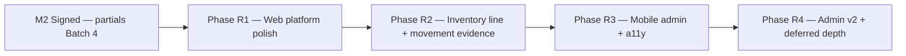

# EMCAP — Standard product residual gaps (post–Phase 18)

**Status:** Planning — 2026-06-18  
**Audience:** Product, engineering, agents  
**Parent:** `plan/17-standard-product-execution-playbook.md` · **Gap plan:** `plan/18-standard-professional-app-gap-plan.md` · **Gate:** `plan/16-product-ready-dod.md` · `spec/sdd/07-product-readiness-matrix.md`  
**Execution memo:** `docs/dev/session-memos/2026-06-18-partials-completion-plan.md`

This document catalogs **residual product gaps** that are **not** on the M2 critical path and **not** already tracked as **Partial** backlog tasks. It does **not** replace `plan/18` Phases A–F or the partials completion memo.

**Honesty rule:** Do not schedule residual work until **Batch 3–4** of the partials memo completes (`flutter test --coverage` green + M2 PNG pack). Backlog **Done** ≠ **Product-ready**.

---

## 1. Executive answer

| Question | Answer |
|----------|--------|
| Need a new plan? | **Yes — partial supplement only** |
| Why not extend `plan/18` Phase F alone? | Phase F is scoped to coverage ratchet + YAML remainder (P18-T19/T22, P20 quality lane). Residual gaps span admin v2, platform polish, and mobile a11y — a separate catalog avoids milestone blur. |
| Why not one mega-plan? | `plan/18` is **Accepted** with 14 tasks and an active partials execution track; re-opening it risks scope creep while M2 PNG pack remains open. |
| Task ID namespace | **`EMCAP-P24-T01`…** (Phase 24 — residual polish). Do **not** use `P21-Txx` (infra phase collision). Optional cross-ref: `P18-T23+` alias in matrix notes only. |

---

## 2. What is already covered (do not re-plan)

### 2.1 Ten Partial tasks — active execution

| Task | Scope | Next step |
|------|-------|-----------|
| P15-T13, P20-T03 | M2 mobile PNG | Partials memo Batch 3–4 |
| P18-T09 | M2 PRODUCT Product-ready | Same |
| P18-T06, P18-T10 | CRM mobile | Same |
| P18-T13 | Bulk actions mobile | `flutter test` verify |
| P18-T16 | Entity platform mobile | PNG + verify |
| P18-T17 | STOCK_MOVEMENT mobile | PNG + verify |
| P18-T18 | Document preview mobile | PNG + verify |
| P18-T20 | SSE/offline mobile | PNG + verify |
| P20-T08 | Matrix 07 milestone rev | After PNG + flutter green |

**Critical path (M2 mobile sign-off):** `cd clients/mobile && flutter pub get && flutter test --coverage` green → M2 PNG pack (`scripts/capture-m2-mobile-screenshots.md`) → Partial → Done. Do not mark Product-ready without PNG evidence. Flutter SDK on PATH — install stable outside Downloads (`known-pitfalls.md` § Flutter PATH).

### 2.2 Phase 18 Done items touching residual themes

| Theme | Covered by | Residual? |
|-------|----------|-----------|
| Enterprise auth UX | P18-T11 Done | No new plan |
| i18n depth (primary surfaces) | P18-T12 Done + `audit-i18n.mjs` | Low-priority strings only |
| Bulk + E2E web | P18-T13 web Done; P18-T14 Done | Mobile in partial |
| M6 admin web | P18-T15, P18-T21 Done | Mobile admin sign-off open |
| Assistant / rule evaluate web | P18-T19 Done | Mobile rule evaluate deferred |
| YAML-only settings | P18-T22 Done (honest read-only) | Editable security deferred |

---

## 3. Residual gap catalog (no task yet → disposition)

| # | Gap | Disposition | Rationale | Proposed ID |
|---|-----|-------------|-----------|-------------|
| 1 | **STOCK_MOVEMENT_LINE UX polish** | **(d) + batch R2** | P20-T21 Done (child browse tab); matrix §16 row **Demo**. Inline child grid density, line totals, screenshot — polish under movement Product-ready bar, not API. | **P24-T02** (web polish) |
| 2 | **Document preview web → Product-ready** | **(a)** | Matrix §10 **Demo**; P17-T06 implementation Done; no DoD screenshot / elevation task. Mobile tracked P18-T18 Partial. | **P24-T01** |
| 3 | **Soft-delete restore screenshot/evidence** | **(d)** | Matrix §8 notes screenshot pending; `entity_record_screen_lifecycle_test.dart` exists. Capture in M2/M3 PNG pack (P18-T09/T16), not net-new scope. | — (acceptance on partials) |
| 4 | **Permission matrix editing** | **(b) post-M2** | Matrix §7 picker Done; matrix view intentionally read-only (P12B-T05). Full matrix editor is admin v2 — out of M6 credible bar. | Defer — note in `plan/19-admin-product-depth.md` §v2 |
| 5 | **Dashboard KPI chart depth** | **(b) post-M2** | P17-T04 KPI **cards** Done; §10 dashboards **Product-ready (web)** with static screenshot. Charts risk bundle budget (P20-T06). | Defer — `plan/17-platform-services-product-ux.md` v2 |
| 6 | **Email/SMS template editor depth** | **(b) post-M2** | P19-T12 Done (variable chips, empty state). Matrix §10 templates **Partial** — credible for M6, not blocking M2. | Defer |
| 7 | **Security settings editable** | **(b) post-M2** | P12C-T19 read-only by design; tenant rate-limit/MFA policy API not in v1 SDD. | Defer — security review required |
| 8 | **Mobile admin Product-ready sign-off** | **(a)** | P12D code Done; no PNG/DoD task; web admin Product-ready (P18-T21). | **P24-T03** |
| 9 | **Rule evaluate on mobile** | **(b) post-M2** | P18-T19 web Done; matrix §7 mobile **No**. Flag-gated tools surface. | Defer |
| 10 | **Mobile a11y (TalkBack/VoiceOver)** | **(b) post-M2** | P15-T30–T32 web axe only. No Flutter semantics audit. | **P24-T04** (when M2 signed) |
| 11 | **i18n residual hardcoded strings** | **(d) + (b)** | P18-T12 Done; `audit-i18n.mjs` documents remainder (reports, low-traffic). Sweep as maintenance, not milestone. | Defer — optional P24-T05 |
| 12 | **Web page spec depth ratchet** | **(a)** | Feedback B15 — Karma thin on some platform/entity edge specs. Quality lane, not product gate. | **P24-T05** |

**Legend:** (a) add backlog now · (b) defer post-M2 · (c) out of scope · (d) covered by existing partial/Done work

**Out of scope v1 (unchanged):** Grafana embed, PCI, hot-install, layout designer beyond ADR-007, new modules beyond inventory/CRM reference (`plan/17` §18).

---

## 4. Proposed phases (after M2 sign-off)



### Phase R0 — Finish partials (NOW — no new features)

| Order | Work | Tasks |
|-------|------|-------|
| R0-1 | `flutter test --coverage` + `flutter analyze` | All 10 Partial |
| R0-2 | M2/M3 PNG pack | P15-T13, P20-T03, P18-T09–T10, T16–T18, T20 |
| R0-3 | Matrix 07 rev | P20-T08 |

### Phase R1 — Web platform polish (first residual batch)

| Order | ID | Work | Acceptance |
|-------|-----|------|------------|
| R1-1 | **P24-T01** | Document preview web Product-ready | `16-product-ready-dod` §3; PNG `phase24-document-preview-web.png`; matrix §10 **Demo → Product-ready** |
| R1-2 | **P24-T05** | Web page spec depth ratchet | +Karma specs for document preview panel, movement line tab, soft-delete restore banner; branches maintain ≥80% |

### Phase R2 — Inventory movement line polish

| Order | ID | Work | Acceptance |
|-------|-----|------|------------|
| R2-1 | **P24-T02** | STOCK_MOVEMENT_LINE inline child UX | Line grid on movement record: qty/cost columns, add-line flow, empty state; PNG; matrix §16 LINE row ≥ Demo+ |
| R2-2 | — | Tie to P18-T17 mobile | Mobile movement PNG includes line tab visible |

### Phase R3 — Mobile admin + accessibility

| Order | ID | Work | Acceptance |
|-------|-----|------|------------|
| R3-1 | **P24-T03** | Mobile admin Product-ready sign-off | PNG pack: users, roles, security field matrix; matrix §12 mobile rows; `admin_*_test.dart` green |
| R3-2 | **P24-T04** | Mobile semantics audit | `Semantics` labels on entity list/record primary actions; manual TalkBack/VoiceOver checklist in recipe |

### Phase R4 — Deferred admin/platform depth (backlog when scheduled)

| Item | Trigger | Notes |
|------|---------|-------|
| Permission matrix editor | Post-M6 v2 | API for bulk permission assign |
| Dashboard charts | Post-M5 | Lazy-load chart module; bundle check |
| Template editor depth | Post-M6 | Preview/send test, version history |
| Editable security policy | Post-M6 + security review | `PUT /admin/security/policy` |
| Rule evaluate mobile | `ai.enabled` + demand | Mirror `settings/rules` panel |
| i18n residual sweep | Any touch of affected files | `node scripts/audit-i18n.mjs` gate |

---

## 5. Priority order vs critical path

| Priority | Work | Blocker |
|----------|------|---------|
| **P0** | Partials Batch 3–4 (M2 sign-off) | Device / PNG capture |
| **P1** | P20-T08 matrix rev with evidence | P0 |
| **P2** | P24-T01 document preview web | None after P0 |
| **P3** | P24-T02 movement line polish | Optional parallel with P2 |
| **P4** | P24-T03 mobile admin sign-off | P0 (reuse PNG runbook) |
| **P5** | P24-T04 mobile a11y | P0 |
| **P6** | P24-T05 spec ratchet | CI only |
| **P7** | Phase R4 deferred items | Product call |

**Do not start P24-* until P0 completes** — avoids false Product-ready claims and doc drift.

---

## 6. Task table (Phase 24)

| ID | Task | Depends | Layer | Acceptance (summary) |
|----|------|---------|-------|----------------------|
| **EMCAP-P24-T01** | Document preview web Product-ready elevation | P17-T06 | Web, Doc | DoD §3; PNG; matrix §10 row |
| **EMCAP-P24-T02** | STOCK_MOVEMENT_LINE child grid UX polish | P20-T21 | Web, Doc | Inline lines UX + PNG; matrix §16 LINE row |
| **EMCAP-P24-T03** | Mobile admin Product-ready sign-off | P18-T09, P18-T21 | Mobile, Doc | Admin PNG pack; matrix §12 mobile |
| **EMCAP-P24-T04** | Mobile a11y semantics (TalkBack/VoiceOver) | P18-T09 | Mobile, Doc | Semantics on primary flows; manual checklist recipe |
| **EMCAP-P24-T05** | Web page spec depth ratchet | P20-T04 | Web, CI | Karma depth for preview/movement/restore; ≥80% branches |

**Count:** 5 net-new tasks. Phase R4 items remain **unscheduled** until explicitly pulled.

---

## 7. Verification

```bat
REM After P0 (partials)
flutter --version
cd clients\mobile && flutter pub get && flutter test --coverage && flutter analyze
node scripts\capture-m2-mobile-screenshots.md

REM R1–R2 web
cd clients\web && npm run test:ci && npm run test:coverage
node scripts\capture-screenshot-sprint.mjs --only=platform-services

REM R3 mobile admin
cd clients\mobile && flutter test test/admin_*
```

Doc sync on any P24 Done: `docs/dev/recipes/sync-docs-after-change.md`, matrix **07**, backlog row, `codebase-index.md` if new tests/paths.

---

## 8. References

| Document | Role |
|----------|------|
| `plan/18-standard-professional-app-gap-plan.md` | Primary gap roadmap Phases A–F |
| `docs/dev/session-memos/2026-06-18-partials-completion-plan.md` | Active M2 execution |
| `plan/20-standard-entity-rollout.md` | W5 movement entities |
| `plan/19-admin-product-depth.md` | Admin v1 scope; v2 deferrals |
| `spec/sdd/06-admin-product-ui-matrix.md` | Admin Demo rows |
| `spec/sdd/07-product-readiness-matrix.md` | Product gate |
| `docs/product/user-feedback-registry.md` | B15 spec depth |

---

**Historical planning artifact (2026-06-18).** Phases **24–29 Done** (2026-06-23). **Mobile sign-off complete** (2026-06-29 — 33 PNGs). **Current focus:** Phase **30** web Demo+ elevation + Phase **31** R4 v2 — `plan/22-web-demo-plus-and-r4-execution.md`, `plan/03-task-backlog.md` Phase 30–31, `docs/dev/HANDOFF-continue-standard-product.md`.
