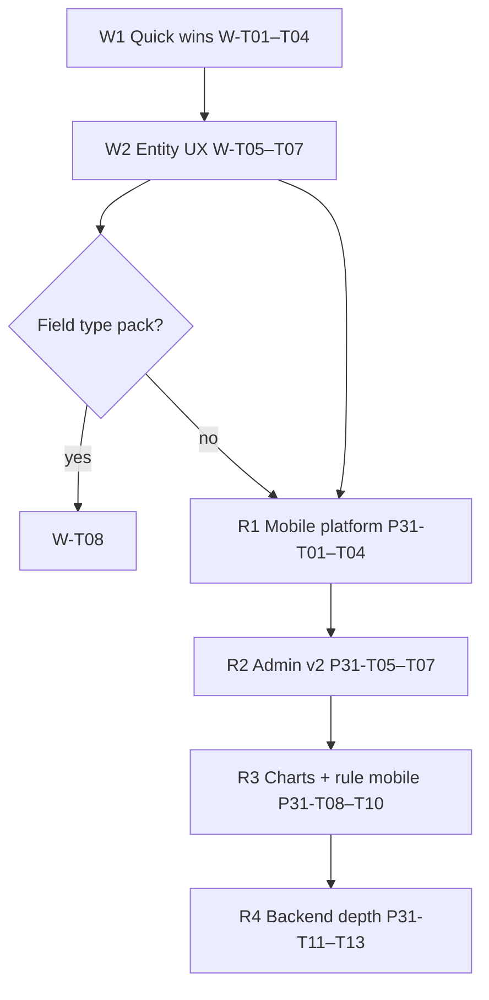

# Web Demo+ elevation + Phase R4 v2 — execution plan

**Status:** Planning — 2026-06-29  
**Prereq:** Mobile sign-off complete (33 mobile PNGs; M1–M6 mobile lanes signed). Backlog **0 Pending / 0 Partial**.  
**Gates:** `plan/16-product-ready-dod.md` · `spec/sdd/07-product-readiness-matrix.md` · `plan/21-standard-product-residual-gaps.md` §Phase R4  
**Parent:** `plan/17-standard-product-execution-playbook.md`

---

## Executive summary

| Track | Scope | Effort | Outcome |
|-------|--------|--------|---------|
| **W — Web Demo+ elevation** | 11 matrix rows still Demo/Demo+ on **web** | **~2–3 sprints** (screenshot + polish + karma) | Web parity with mobile Product-ready where feature exists on both surfaces |
| **R — Phase R4 v2** | 6 deferred platform/admin depth items | **~4–6 sprints** | New routes/APIs; not screenshot-only |

**Do not** mark Product-ready from pytest/Karma alone — each row needs PNG + DoD §3/§5 checklist.

---

## Track W — Web Demo+ elevation

### W0 — Inventory (current matrix 07 web gaps)

| § | Capability | Web today | Mobile | Elevation blockers |
|---|------------|-----------|--------|-------------------|
| 8 | Soft delete + restore | Demo | Product-ready | Web restore banner PNG; karma lifecycle spec |
| 8 | Enum / lookup / currency / textarea | Demo | Demo (v1 accepted) | Optional — field-type screenshot pack on PRODUCT record |
| 8 | Status chip metadata | Demo | Product-ready | Web hero chip PNG; align with `record-detail-header` |
| 9 | Loading skeleton + error retry | Demo+ | Product-ready | Web error-retry PNG (`phase15-product-grid-error-retry.png` may be missing); entity-list coverage spec |
| 10 | Assistant | Demo+ | N/A | Flag gate UX; empty/retry states — elevate or keep Demo+ |
| 10 | Rule evaluate | Demo+ | N/A | Same as assistant |
| 19 | Logo blob upload | Demo+ | Product-ready | Web logo picker PNG (`phase26-organization-logo-web.png` exists?) |
| 19 | Favicon + accent branding | Demo+ | Product-ready | `phase19-settings-branding-web.png` **exists** — elevate row + DoD |
| 19 | PDF grid export org header | Demo+ | N/A | Print preview PNG; `export.util.spec.ts` already green |
| 19 | INVOICE print view | Demo+ | Product-ready | Web print PNG; `entity-record` print flow |
| 19 | Email signature (templates) | Demo+ | N/A | API-only; optional admin preview PNG |

### W1 — Quick wins (PNG on disk or trivial capture)

| ID | Work | Capture / evidence | Matrix row |
|----|------|-------------------|------------|
| **W-T01** | §19 favicon/accent branding web | `phase19-settings-branding-web.png` (exists) | §19 favicon → **Product-ready (web)** |
| **W-T02** | §19 logo upload web | `node scripts/capture-screenshot-sprint.mjs --only=org` or settings pack | §19 logo web → Product-ready |
| **W-T03** | §19 INVOICE print web | `capture-signoff-screenshots.mjs --only=p25` or entity print | §19 invoice print web → Product-ready |
| **W-T04** | §8 soft delete restore web | Capture PRODUCT record with restore banner; karma `entity-record` lifecycle | §8 soft delete web → Product-ready |

**Verify:** `cd clients/web && npm run test:ci` · capture scripts against live stack.

### W2 — Entity UX polish (web-only Demo+)

| ID | Work | Acceptance |
|----|------|------------|
| **W-T05** | §9 loading + error retry web | `LoadingPanelComponent` + grid error retry visible; PNG `phase15-product-grid-error-retry.png`; `entity-list.component.spec.ts` error branch |
| **W-T06** | §8 status chip web | ACTIVE chip on `record-detail-header`; PNG in M1 hero pack refresh |
| **W-T07** | §19 PDF export org header | Print dialog / export HTML shows org header; PNG from entity-list export; karma `export.util.spec.ts` |

### W3 — Field types (optional v1.1 — both surfaces Demo)

| ID | Work | Acceptance |
|----|------|------------|
| **W-T08** | Field-type screenshot pack | PRODUCT record showing enum, lookup, currency, textarea; web + mobile PNGs; matrix §8 → Product-ready **if** UX review passes |

**Recommendation:** Keep §8 **Demo v1 accepted** unless product wants parity marketing screenshots.

### W4 — Platform tools (stay Demo+ or partial R4)

| ID | Work | Decision |
|----|------|----------|
| **W-T09** | Assistant web | Elevate to Product-ready only if `ai.enabled` demo path + PNG; else leave Demo+ |
| **W-T10** | Rule evaluate web | Same; formula gate + retry PNG |

---

## Track R — Phase R4 v2 features

From `plan/21` §Phase R4. **New backlog:** **Phase 30** web Demo+ (`EMCAP-P30-T01`…`T10`) · **Phase 31** R4 v2 (`EMCAP-P31-T01`…`T13`).

### R1 — Mobile platform services (highest user-visible R4)

| ID | Feature | Layer | Acceptance |
|----|---------|-------|------------|
| **P31-T01** | Mobile reports + history | Mobile shell route, `ReportsScreen` depth | List runs, history, empty/error; PNG; matrix §10 N/A → Product-ready mobile |
| **P31-T02** | Mobile dashboards | Mobile | KPI cards read-only mirror web; PNG |
| **P31-T03** | Mobile notifications | Mobile | Inbox list, mark read; PNG |
| **P31-T04** | LOW_STOCK on mobile nav | Mobile + modules | Report entry from inventory group |

**Depends:** Existing web APIs (already Product-ready web).

### R2 — Admin v2 depth

| ID | Feature | Layer | Acceptance |
|----|---------|-------|------------|
| **P31-T05** | Permission matrix editor | API `PUT` bulk assign + web grid editor | `plan/19-admin-product-depth.md` §v2; security review |
| **P31-T06** | Editable security policy | API + settings | Rate limit / MFA policy; read-only YAML escape hatch |
| **P31-T07** | Email/SMS template editor depth | Web settings | Preview, send test, version note |

### R3 — Platform polish

| ID | Feature | Layer | Acceptance |
|----|---------|-------|------------|
| **P31-T08** | Dashboard KPI charts | Web lazy chunk | Chart module behind flag; bundle budget check (P20-T06) |
| **P31-T09** | Rule evaluate mobile | Mobile settings/tools | Mirror web when `ai.enabled`; PNG |
| **P31-T10** | i18n residual sweep | Web + mobile | `node scripts/audit-i18n.mjs` zero new violations on touched files |

### R4 — Backend depth (matrix Demo rows)

| ID | Feature | Layer | Acceptance |
|----|---------|-------|------------|
| **P31-T11** | Transfer + posted movement UX | modules/inventory | Web movement post flow shows qty update; matrix §16 Demo → Product-ready |
| **P31-T12** | PO receive → STOCK_MOVEMENT spawn UX | modules/procurement | Visible spawn link on PO detail; pytest + PNG |
| **P31-T13** | Finance field security UX | Web entity | Hidden fields when `accounting.view` denied; karma + pytest |

---

## Recommended execution order



| Priority | Track | First tasks | Parallel? |
|----------|-------|-------------|-----------|
| **P1** | W1 | W-T01 branding web, W-T04 soft-delete web | Yes — capture batch |
| **P2** | W2 | W-T05 grid error-retry web, W-T06 status chip | After W1 |
| **P3** | R1 | P31-T01 mobile reports (largest R4 slice) | After W1 or parallel team |
| **P4** | R2 | P31-T05 permission matrix | Needs API design |
| **P5** | R3–R4 | Charts, movement backend UX | Product-scheduled |

---

## Verification (per task)

```bat
node scripts/check-api-health.mjs
cd clients\web && npm run test:ci && npm run test:coverage
node scripts\capture-screenshot-sprint.mjs --only=settings
node scripts\capture-signoff-screenshots.mjs --only=p25

cd clients\mobile
flutter test --coverage
node ..\..\scripts\capture-mobile-signoff-screenshots.mjs --only=p17

cd platform\api
python -m pytest -q
```

**Doc sync:** `docs/dev/recipes/sync-docs-after-change.md` — matrix **07**, backlog **P30/P31** rows, `HANDOFF-continue-standard-product.md`, `codebase-index.md`.

---

## Task count summary

| Track | New tasks | Est. |
|-------|-----------|------|
| W (Web Demo+) | P30-T01–T10 (10) | 2–3 sprints |
| R (Phase R4) | P31-T01–T13 (13) | 4–6 sprints |
| **Total** | **23** | Schedule R after W1 quick wins |

---

## Out of scope (unchanged)

- Grafana embed, PCI, hot-install
- Grid–form parity (C16 rejected)
- False Product-ready without PNG evidence

**Next action:** Start **W-T01** (elevate §19 branding web — PNG exists) + **W-T04** (soft-delete web capture) in parallel against live stack.
