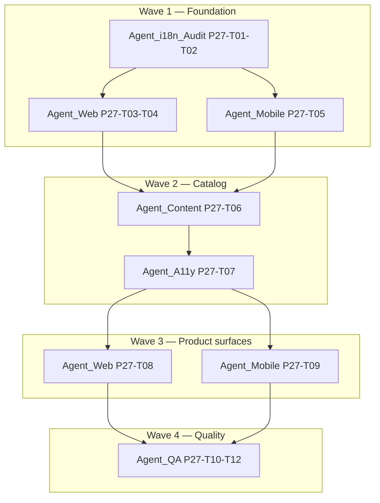

# Phase 27 — i18n / l10n localization (BCP 47, CLDR, memory-efficient)

**Plan file:** `plan/26-i18n-l10n-localization.md` (i18n track)  
**Sibling:** `plan/26-business-profile-configuration.md` (Phase 26A — org profile; **Done** W1)  
**Parent:** `plan/17-standard-product-execution-playbook.md`  
**Gap audit:** `docs/dev/session-memos/2026-06-18-i18n-gap-audit.md`  
**Status:** Planning complete — 2026-06-18  
**Task namespace:** **P27-T01–T12** (Phase 26 task IDs reserved for business profile P26-T01–T15)

---

## Requirements

| ID | Scope | Notes |
|----|-------|-------|
| FR-008c | End-user i18n depth | Extends existing partial coverage |
| FR-008d | Enterprise shell i18n/themes | BCP 47 + full-page catalogs |
| FR-019 | SDK localization hooks | Metadata `label_key` unchanged; app chrome migrates |
| **FR-029** (proposed) | Strict BCP 47 locales (`en-US`, `bn-BD`), CLDR plurals, regional numerals, interpolation-only messages, lazy locale chunks, a11y/compliance string catalog | Trace in `03-traceability-matrix.md` at P27-T01; add row to `01-requirements.md` when implementation starts |

**Not in scope Wave 1–3:** Full `fr-FR` professional review; RTL; ICU MessageFormat in backend; `@angular/localize` extract pipeline (optional Wave 4).

---

## Architecture decisions

### AD-1 — BCP 47 locale tags (breaking migration)

| Before | After |
|--------|-------|
| `AppLocale = 'en' \| 'fr' \| 'bn'` | `AppLocale = 'en-US' \| 'bn-BD' \| 'fr-FR'` |
| Files `en.json`, `bn.json` | Files `en-US.json`, `bn-BD.json` (+ alias shims one release) |
| `localStorage emcap-locale = en` | `emcap-locale = en-US` |
| `document.documentElement.lang = en` | `lang="en-US"` / `lang="bn-BD"` |
| Mobile `Locale('bn')` | `Locale.fromSubtags(languageCode: 'bn', countryCode: 'BD')` |

**Alias map (read path, one release):** `en`→`en-US`, `bn`→`bn-BD`, `fr`→`fr-FR`. Write path always canonical tag.

**Org profile default:** `organization_profile.locale` validates against supported BCP 47 list; default `en-US`.

### AD-2 — UTF-8 and message shape

- All bundle files **UTF-8** without BOM; CI grep rejects `\uXXXX` escapes for Bengali in `bn-BD.json`.
- **No string concatenation** in TS/Dart/HTML for user-visible text. Use placeholders: `{name}`, `{count}`, `{date}`, `{companyName}`, `{ratio}`.
- Word order varies by locale — full sentence in each bundle value.

### AD-3 — CLDR pluralization (one / other)

Both `en-US` and `bn-BD` use CLDR **`one`** and **`other`** categories only (no `few`/`many` for Bengali in v1).

Key pattern:

```
plural.<id>.one   → "{count} record"
plural.<id>.other → "{count} records"
```

Runtime:

```typescript
plural('plural.recordCount', count, { count: formatInteger(count) })
```

Category rule: `count === 1` → `one`; else → `other`. (Bengali uses same keys; copy may repeat — acceptable for v1.)

### AD-4 — Regional numerals

| Locale | Integer display | Currency |
|--------|-----------------|----------|
| `en-US` | Western Arabic `0-9` via `Intl.NumberFormat('en-US')` | `Intl.NumberFormat('en-US', { style: 'currency', currency })` |
| `bn-BD` | Bengali digits `০-৯` via `Intl.NumberFormat('bn-BD')` | Same locale tag; symbol placement per CLDR |

Utilities: `clients/web/src/app/shared/utils/locale-format.util.ts`, `clients/mobile/lib/utils/locale_format_util.dart`.

**Do not** hand-roll digit maps except as test fixtures.

### AD-5 — Bengali copy standards

- Concise professional Bengali; target **≤30%** character expansion vs English for chrome strings.
- Avoid literal calques; use standard ERP terms (ইনভয়েস, পেমেন্ট, সেটিংস).
- Agent_Content reviews diff with expansion linter script (Wave 3).

### AD-6 — Memory-efficient loading

| Concern | Pattern |
|---------|---------|
| Bundle size | Split by domain chunk: `core`, `admin`, `settings`, `entity`, `finance` (lazy `import()`) |
| Active locale | Keep **one** resolved locale Map in memory; evict others on switch |
| Mobile startup | Load `core` only; fetch `admin`/`settings` on first route |
| Metadata i18n | Unchanged — field labels from API metadata maps, not duplicated in app bundles |
| Cache | `I18nService` signal + `Map<string,string>` per chunk; no duplicate flat copies across web/mobile in runtime (files still synced in repo) |

### AD-7 — Security

- **No secrets** in locale JSON (API keys, tokens, passwords, internal hostnames).
- Privacy strings describe capability, not tenant data.
- Deployment version uses `{version}` from build env at runtime, not hard-coded in JSON.

---

## Gap inventory

| Domain | Keys (web EN) | BN complete | Web↔mobile parity | Priority |
|--------|---------------|-------------|-------------------|----------|
| Shell / nav / toolbar | ~26 | 9 missing module labels | Drift | P1 |
| Admin | ~97 | Yes | Synced | P2 |
| Settings / platform | ~239 | Partial mobile org | 18 key drift | P1 |
| Entity / grid / record | ~72 | Partial | Movement lines web-only | P1 |
| Procurement / sales (P25) | ~22 | Module nav BN gap | Partial | P1 |
| Business profile (P26) | ~25 | Mobile BN −13 fields | Web-heavy | P1 |
| **Accessibility** | **0** | **0** | — | **P0** |
| **UX / design** | **0** | **0** | — | **P1** |
| **Security / privacy chrome** | **0** | **0** | — | **P1** |
| **Deployment / stores** | **0** | **0** | — | **P2** |
| **Plurals** | **0** | **0** | — | **P0** |
| **Centralized errors** | scattered | partial | drift | P2 |
| Number / date format utils | 0 | 0 | — | **P0** |
| `spec/i18n/emcap-ui-keys.json` | 17 required | stale | — | P1 |

**Starter seed:** `data/i18n/seed/starter-catalog.json` — 40+ keys × `en-US` / `bn-BD` for a11y, ux, tech, security, deployment, org, plurals.

---

## Pluralization spec

### Key naming

```
plural.<entity>.one
plural.<entity>.other
```

### Initial catalog

| ID | en-US one | en-US other |
|----|-----------|-------------|
| `recordCount` | `{count} record` | `{count} records` |
| `notificationCount` | `{count} unread notification` | `{count} unread notifications` |
| `fileSelected` | `{count} file selected` | `{count} files selected` |
| `bulkSelected` | `{count} row selected` | `{count} rows selected` |
| `paymentCount` | `{count} payment` | `{count} payments` |

### API (web)

```typescript
interface I18nParams { [key: string]: string | number }

t(key: string, params?: I18nParams): string;
plural(baseKey: string, count: number, params?: I18nParams): string;
```

Implementation: resolve `baseKey.one` / `baseKey.other`, then replace `{token}` left-to-right. **Never** `t('a') + count + t('b')`.

### API (mobile)

```dart
String t(String key, {Map<String, String>? params, String? localeTag});
String plural(String baseKey, num count, {Map<String, String>? params, String? localeTag});
```

---

## Interpolation rules

| Rule | Example |
|------|---------|
| Placeholder syntax | `{name}` — ASCII braces, camelCase names |
| Escaping | Literal `{` as `'{{'` in JSON value (rare) |
| Dates | Pass pre-formatted `{date}` from `formatDate(value, localeTag)` |
| Numbers in messages | Pass `{count}` already localized via `formatInteger` |
| HTML | No HTML in strings; use separate keys for link labels |
| Metadata | `{{display_name}}` **only** in org document templates (P26), not in app i18n |

---

## Web — Angular changes

| File | Change |
|------|--------|
| `shared/services/i18n.service.ts` | BCP 47 type; lazy chunk loader; `t()` + `plural()`; alias migration in `init()` |
| `assets/i18n/en-US.json`, `bn-BD.json` | Rename from `en.json`/`bn.json`; merge seed + gap fixes |
| `shared/utils/locale-format.util.ts` | `formatInteger`, `formatCurrency`, `formatDate`, `resolvePluralCategory` |
| `shared/services/i18n.service.spec.ts` | Interpolation, plural, alias, chunk load, bn-BD numerals |
| `shared/utils/locale-format.util.spec.ts` | **New** — Intl behavior fixtures |
| Toolbar / account locale picker | Labels `toolbar.language.en-US`, `toolbar.language.bn-BD` |
| `spec/i18n/emcap-ui-keys.json` | Expand required keys + locale list |

**Chunk layout (web):**

```
assets/i18n/
  en-US.core.json
  en-US.admin.json
  ...
  bn-BD.core.json
  manifest.json   # chunk list + hashes
```

Wave 2 merges flat files → chunked; Wave 1 may keep single file with BCP 47 rename for smaller diff.

---

## Mobile — Flutter changes

| File | Change |
|------|--------|
| `services/i18n_service.dart` | Single active locale cache; lazy chunk load; `t`/`plural` params |
| `services/preferences_service.dart` | Persist BCP 47 tag |
| `assets/i18n/en-US.json`, `bn-BD.json` | Rename + parity sync |
| `utils/locale_format_util.dart` | **New** — Intl parity |
| `test/i18n_keys_parity_test.dart` | Assert web/mobile key equality post-sync |
| `test/i18n_bundle_test.dart` | Interpolation + plural + lazy load |
| `test/locale_format_util_test.dart` | **New** — Bengali digits |

**Constraint:** `dart test` only — **do not run `flutter run`** per user/environment standing order.

---

## Number / date formatting

```typescript
// Web — locale-format.util.ts
export function formatInteger(value: number, locale: AppLocale): string;
export function formatCurrency(value: number, currency: string, locale: AppLocale): string;
export function formatDateMedium(value: Date, locale: AppLocale): string;
```

Mobile mirrors with `intl` package (already transitive via Flutter).

Grid currency columns: use locale formatter in `field-display.util.ts` / `field_display.dart` when displaying read-only amounts (not input mask).

---

## Multi-agent execution model



| Agent | Role | Tasks | Parallel with |
|-------|------|-------|---------------|
| **Agent_i18n_Audit** | Inventory locale files, key diff scripts, update `spec/i18n/` | P27-T01, P27-T02 | — |
| **Agent_Web** | Angular service, format utils, Karma ≥80% branches | P27-T03, P27-T04, P27-T08 | Agent_Mobile after T02 |
| **Agent_Mobile** | Dart service, format utils, dart tests (no flutter run) | P27-T05, P27-T09 | Agent_Web after T02 |
| **Agent_Content** | Bengali bn-BD professional pass, expansion lint | P27-T06 | After T03–T05 |
| **Agent_A11y** | WCAG + mobile a11y string catalog wired to components | P27-T07 | After seed merge |
| **Agent_QA** | Coverage gates, parity CI, doc sync, loop verify | P27-T10, P27-T11, P27-T12 | Final |

---

## Task breakdown

| ID | Task | Agent | Wave | Depends | Status |
|----|------|-------|------|---------|--------|
| P27-T01 | Plan + gap audit + FR-029 trace note + backlog | Architect | 0 | — | **Done** (this doc) |
| P27-T02 | BCP 47 migration spec; alias map; rename bundle files; update `emcap-ui-keys.json` | Agent_i18n_Audit | 1 | T01 | Pending |
| P27-T03 | Web `I18nService` — lazy chunks, `t`/`plural`, BCP 47 persistence | Agent_Web | 1 | T02 | Pending |
| P27-T04 | Web `locale-format.util.ts` + karma spec (numerals, currency, date) | Agent_Web | 1 | T02 | Pending |
| P27-T05 | Mobile `I18nService` + `locale_format_util.dart` + dart tests | Agent_Mobile | 1 | T02 | Pending |
| P27-T06 | Merge seed catalog; fix BN gaps; web/mobile key parity (667+ keys) | Agent_Content | 2 | T03–T05 | Pending |
| P27-T07 | Wire `a11y.*`, `ux.*`, `security.*`, `deployment.*` to shell/settings/account | Agent_A11y | 2 | T06 | Pending |
| P27-T08 | P25 finance + P26 org i18n completion on web; axe label spot-check | Agent_Web | 3 | T07 | Done |
| P27-T09 | Mobile parity: org panel BN, finance strings, a11y semantics | Agent_Mobile | 3 | T07 | Done |
| P27-T10 | Parity script in CI; `i18n_keys_parity_test` green; coverage ≥80% | Agent_QA | 4 | T08–T09 | Done |
| P27-T11 | Matrix 06/07 + traceability + pitfall entry + codebase-index sync | Agent_QA | 4 | T10 | Done |
| P27-T12 | Full verify + screenshot spot-check (locale switch) | Agent_QA | 4 | T11 | Pending |

---

## `/loop` dynamic verification

Per `.cursor/skills-cursor/loop/SKILL.md` — **dynamic schedule** for Phase 27.

### Primary wake — git watcher

```powershell
# Loop git watcher: i18n file changes (PowerShell)
$repo = "c:\Users\u1074139\workstation\Study\SDD"
$last = ""
while ($true) {
  $sig = (git -C $repo status --porcelain -- "clients/web/src/assets/i18n" "clients/mobile/assets/i18n" "clients/web/src/app/shared/services/i18n.service.ts" "clients/mobile/lib/services/i18n_service.dart" "spec/i18n" 2>$null) -join "`n"
  if ($sig -and $sig -ne $last) {
    $last = $sig
    Write-Output 'AGENT_LOOP_WAKE_P27 {"prompt":"Run P27 i18n verify: npm run test:coverage in clients/web; dart test test/i18n_bundle_test.dart test/i18n_keys_parity_test.dart test/locale_format_util_test.dart in clients/mobile if SDK available; report branch coverage and parity."}'
  }
  Start-Sleep -Seconds 30
}
```

### Fallback heartbeat — 45 minutes

```powershell
Start-Sleep -Seconds 2700
Write-Output 'AGENT_LOOP_WAKE_P27 {"prompt":"P27 heartbeat: run web test:coverage (80% branch gate) and mobile dart i18n tests; summarize gaps vs plan/26-i18n-l10n-localization.md"}'
```

### Verify commands (each wake)

```powershell
cd c:\Users\u1074139\workstation\Study\SDD\clients\web
npm run test:coverage

cd c:\Users\u1074139\workstation\Study\SDD\clients\mobile
dart test test/i18n_bundle_test.dart test/i18n_keys_parity_test.dart test/locale_format_util_test.dart test/admin_i18n_strings_test.dart

cd c:\Users\u1074139\workstation\Study\SDD
node scripts/audit-i18n.mjs
```

Skip `flutter test` / `flutter run` when SDK absent (CI remains authoritative).

---

## Zero-regression checklist

- [ ] Locale switch EN→BN updates toolbar, nav, settings without reload
- [ ] `en`/`bn` stored locale aliases migrate to `en-US`/`bn-BD` once
- [ ] Metadata `label_key` resolution unchanged
- [ ] Org profile templates still use `{{display_name}}` tokens (separate from `{name}` app i18n)
- [ ] No secrets added to JSON bundles (grep `api_key`, `password`, `secret`)
- [ ] Web branch coverage ≥80% after new specs
- [ ] `i18n_keys_parity_test.dart` passes web/mobile equality
- [ ] Bengali amounts in grid use Bengali digits when locale `bn-BD`
- [ ] axe a11y specs still pass (`entity-list.a11y.spec.ts`, `settings.a11y.spec.ts`)
- [ ] Hard-coded string audit trend down (`scripts/audit-i18n.mjs`)

---

## Matrix / backlog / doc sync (mandatory on implementation)

| Document | Update when |
|----------|-------------|
| `plan/03-task-backlog.md` | Task status changes |
| `spec/sdd/03-traceability-matrix.md` | FR-029 mapped to P27-T* |
| `spec/sdd/01-requirements.md` | Add FR-029 row at T11 |
| `spec/sdd/06-admin-product-ui-matrix.md` | i18n row → Partial→Done |
| `spec/sdd/07-product-readiness-matrix.md` | Product-ready i18n evidence |
| `docs/dev/codebase-index.md` | New paths, tests, seed dir |
| `docs/dev/known-pitfalls.md` | BCP 47 / parity pitfall if fixed |
| `docs/dev/recall-index.md` | Link session memo |

Recipe: `docs/dev/recipes/sync-docs-after-change.md`

---

## Appendix A — Sample production bundle excerpt

See `data/i18n/seed/starter-catalog.json` for full `en-US` / `bn-BD` top-level locale objects.

Excerpt:

```json
{
  "schema_version": "2",
  "defaultLocale": "en-US",
  "locales": {
    "en-US": {
      "a11y.skipToContent": "Skip to main content",
      "plural.recordCount.one": "{count} record",
      "plural.recordCount.other": "{count} records",
      "org.logo.alt": "{companyName} logo"
    },
    "bn-BD": {
      "a11y.skipToContent": "মূল বিষয়বস্তুতে যান",
      "plural.recordCount.one": "{count}টি রেকর্ড",
      "plural.recordCount.other": "{count}টি রেকর্ড",
      "org.logo.alt": "{companyName} লোগো"
    }
  }
}
```

---

## Appendix B — Business profile i18n keys (P26 cross-reference)

| Key | en-US (existing `settings.organization.*`) | bn-BD status |
|-----|---------------------------------------------|--------------|
| Display / legal name | `settings.organization.displayName`, `legalName` | BN legalName mobile missing |
| Contact | `email`, `phone`, `website` | BN partial |
| Address block | `addressLine1`…`country` | BN mobile missing |
| Tax / fiscal | `taxId`, `fiscalYearStart` | BN mobile missing |
| Logo | `logoUrl`, `logoPreviewAlt` (`{companyName}`) | Alt text add in P27-T08 |
| Templates | `invoiceHeader`, `invoiceFooter`, `reportHeader`, `reportFooter`, `emailSignature` | Web only keys today |
| Hint | `templatesHint` with token list | Web only |

---

## Verify (Wave 1 complete target)

```powershell
cd clients/web
npm run test:ci
npm run test:coverage

cd ..\mobile
dart test test/i18n_bundle_test.dart test/i18n_keys_parity_test.dart

cd ..\..
node scripts/audit-i18n.mjs
```

**Wave 4 exit:** Matrix 06 i18n **Done** with locale-switch screenshot; FR-029 traced; branch coverage ≥80% web; dart i18n tests green.
