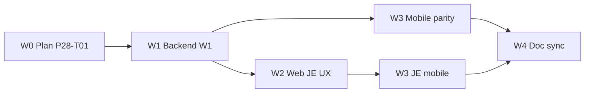
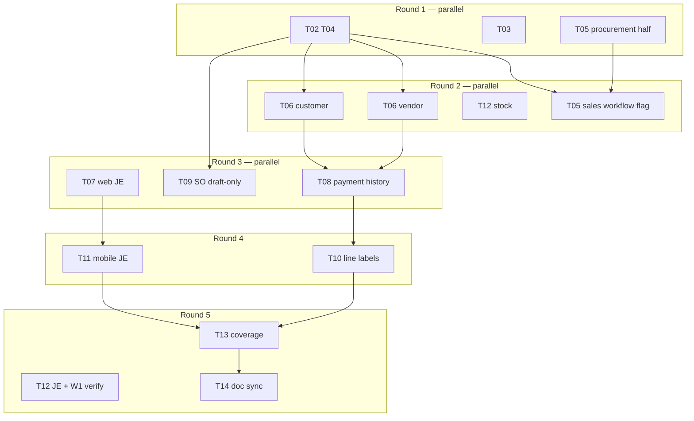

# Phase 28 — Application review remediation

**Status:** Complete — 2026-06-22 (W1–W4 verify green)  
**Parent:** `plan/17-standard-product-execution-playbook.md`  
**Source:** Application review (2026-06-20) — validation gaps, workflow parity, finance UX  
**Gate:** NFR-003 / NFR-004 — **≥80% branch coverage (web Karma)**, **≥80% line (API pytest, Flutter)** on every wave

**Honesty rule:** Backlog **Done** ≠ **Product-ready**. Matrix 07 sign-off requires PNG evidence + verify green.

---

## Executive summary

Web is demo/sign-off ready; mobile code/tests are largely green (508/508, ~85% line). The highest **product risk** is incomplete **business rules** (INVOICE/PRODUCT validators, status transitions, payment voids) and **web/mobile finance parity** (SO add-line mismatch, payment history, JE Post/Void UX).

This phase closes those gaps in four waves. Each wave ends with explicit coverage verify — no task is Done without tests.

---

## Requirements

| ID | Scope |
|----|-------|
| FR-030 | Finance hardening — INVOICE/PRODUCT validators, SO/PO transition guards, payment void, JE UX parity |
| FR-018 | Business logic in `modules/` only via `ENTITY_VALIDATORS` (extends P25) |
| FR-025 / FR-026 / FR-027 | Regression-safe extensions to P25 domain rules |
| NFR-003 | Web Karma **≥80% branches** after each client wave |
| NFR-004 | API pytest **≥80%** line; Flutter **≥80%** line on touched packages |

---

## Coverage gate (mandatory per wave)

Recipe: `docs/dev/recipes/add-coverage-gate.md`

| Layer | Command | Gate | Notes |
|-------|---------|------|-------|
| API | `cd platform/api && python -m pytest --cov=src --cov-fail-under=80 -q` | **80% line** | Add tests in `tests/test_*_entities.py` for new validators |
| Web | `cd clients/web && npm run test:coverage` | **80% branches** | Extend `entity-record.component.spec.ts`, new `invoice.util.spec.ts` / `journal-entry.util.spec.ts` as needed |
| Mobile | `cd clients/mobile && flutter test --coverage` + `python ../../scripts/check-flutter-coverage.py --lcov coverage/lcov.info --min 80` | **80% line** | Extend `*_util_test.dart`, `entity_record_screen_*_test.dart` |

**Branch coverage strategy (web):** hit both sides of `if`/`switch` in new finance helpers — call public component methods directly (`canAddOrderLine`, `canPostJournal`, payment history empty/populated branches). See recipe § Web branch coverage strategy.

**Ratchet rule:** if a wave drops below 80%, add specs in the **same PR** before marking tasks Done.

---

## Findings → task map

| Review finding | Task(s) | Wave |
|----------------|---------|------|
| INVOICE missing `ENTITY_VALIDATORS` | P28-T02 | W1 |
| PRODUCT direct `quantity_on_hand` edit | P28-T03 | W1 |
| SO confirmed with zero lines | P28-T04 | W1 |
| PO/SO `workflow_enabled` without definitions | P28-T05 | W1 |
| Payment void / balance rollback missing | P28-T06 | W1 |
| JE child lines + Post/Void missing (both clients) | P28-T07, P28-T11 | W2, W3 |
| Mobile SO add-line allows `confirmed` (web draft-only) | P28-T09 | W3 |
| Mobile PO/Invoice missing payment history list | P28-T08 | W3 |
| Mobile line UUIDs, no footer totals | P28-T10 | W3 |
| Backend edge gaps (insufficient stock, JE void branches) | P28-T12 | W1 |
| Matrix 07 / backlog doc debt (7 mobile PNGs, coverage) | P28-T14 | W4 |
| P26 PDF headers, P24 mobile a11y (already backlog) | P26-T11/T12, P24-T03/T04 | Out of scope — cross-ref only |

---

## Wave 1 — Backend domain hardening (W1)

**Agent lane:** Backend only — no client changes until W1 verify green.

| Task | Deliverable | Tests |
|------|-------------|-------|
| **P28-T02** | `modules/sales/invoice.py` — `validate_invoice_payload`: `amount`/`amount_paid`/`balance_due` consistency; status transitions (`draft`→`sent`→`partial`→`paid`, void guard) | `tests/test_invoice_entities.py` (new) |
| **P28-T03** | Block or reject direct `quantity_on_hand` PUT on PRODUCT unless via posted STOCK_MOVEMENT context | `tests/test_product_stock_guard.py` (new) |
| **P28-T04** | SO validator: reject `confirmed`/`shipped`/`invoiced` when line rollup = 0 | Extend `tests/test_sales_order_entities.py` |
| **P28-T05** | PO/SO: either add minimal workflow defs or set `workflow_enabled=False` on module entities | Module metadata + contract snapshot if defs added |
| **P28-T06** | VENDOR_PAYMENT + CUSTOMER_PAYMENT void path: reverse PO/invoice balances, mark payment voided | Extend payment entity tests |
| **P28-T12** | Edge pytest: stock movement insufficient qty on issue; JE void branch coverage | Extend `test_stock_movement_entities.py`, `test_journal_double_entry.py` |

**W1 verify:**

```powershell
cd platform/api
python -m pytest tests/test_invoice_entities.py tests/test_product_stock_guard.py tests/test_sales_order_entities.py tests/test_vendor_payment_entities.py tests/test_customer_payment_entities.py tests/test_stock_movement_entities.py tests/test_journal_double_entry.py -q
python -m pytest --cov=src --cov-report=term-missing --cov-fail-under=80 -q
```

---

## Wave 2 — Web finance UX (W2)

Depends: P28-T02, P28-T06 (API contracts stable).

| Task | Deliverable | Tests |
|------|-------------|-------|
| **P28-T07** | Web `entity-record`: JOURNAL_ENTRY child-lines grid (reuse `child-lines-section`); Post/Void actions wired to status transitions | `entity-record.component.spec.ts` — post/void branches, child line add |
| **P28-T13a** | Web coverage ratchet for W2 — invoice/journal helpers if extracted | `npm run test:coverage` branches **≥80%** |

**W2 verify:**

```powershell
cd clients/web
npm run test:ci
npm run test:coverage
```

---

## Wave 3 — Mobile finance parity (W3)

Depends: P28-T07 (pattern reference), P28-T09 can parallel W2.

| Task | Deliverable | Tests |
|------|-------------|-------|
| **P28-T08** | Mobile PO/Invoice record: payment history list (parity with web `_loadPaymentHistory`) | `entity_record_screen_*_test.dart` or payment util tests |
| **P28-T09** | Mobile `canAddSalesOrderLine` — **draft-only** to match web `canAddOrderLine()` | Update `sales_order_util.dart` + `sales_order_util_test.dart` |
| **P28-T10** | Mobile child lines: resolve product **names** via lookup cache; line **footer totals** on PO/SO | Extend movement/PO util tests |
| **P28-T11** | Mobile JOURNAL_ENTRY: child lines section + Post/Void FAB/actions | New screen test file |
| **P28-T13b** | Mobile coverage ratchet for W3 | `flutter test --coverage` + check script **≥80%** |

**W3 verify:**

```powershell
cd clients/mobile
flutter pub get
flutter test --coverage
python ../../scripts/check-flutter-coverage.py --lcov coverage/lcov.info --min 80
```

---

## Wave 4 — Product gates & doc sync (W4)

Depends: W1–W3 verify green; mobile PNG pack captured (2026-06-20 session).

| Task | Deliverable |
|------|-------------|
| **P28-T14** | Matrix 07 mobile rows elevated where PNGs exist; backlog Partials → Done (P15-T13, P18-T09, P20-T03/T08, P25-T13 mobile lane); HANDOFF + `known-pitfalls.md` if new patterns |
| **P28-T15** | Optional: `phase25-vendor-payment-detail-mobile.png` + P24 admin mobile PNGs (3) — only if matrix §12/§18 rows require |

**Cross-ref (existing backlog — do not duplicate):**

| Task | Scope |
|------|-------|
| P26-T11/T12 | PDF/report + INVOICE print header injection |
| P26-T13 | Email signature in notifications |
| P24-T03/T04 | Mobile admin PNG + TalkBack/VoiceOver semantics |

---

## Sprint sequence (recommended)



| Sprint | Tasks | Parallel? |
|--------|-------|-----------|
| **S1** | P28-T01 (plan) | — |
| **S2** | P28-T02 → T06, T12 | Backend sequential within validators |
| **S3** | P28-T07, P28-T13a | Web |
| **S4** | P28-T08, T09, T10, T11, P28-T13b | Mobile — one test file at a time |
| **S5** | P28-T14, P28-T15 | Doc + optional PNGs |

**Parallel lanes after S2:** S3 (web) + S4 (mobile T08–T10) can run concurrently; T11 waits for T07 pattern.

---

## Multi-agent orchestration (2026-06-20)

**Goal:** Maximize parallelism while avoiding merge conflicts on shared files (`modules/sales/module.py`, payment void cross-cuts).

### Agent roster

| Agent ID | Expertise | Tasks | File ownership (no overlap) |
|----------|-----------|-------|----------------------------|
| **A1 — Backend Sales** | Python / P25 validators / `emcap-entity-sdk` | T02, T04 → then **T06** (customer side) | `modules/sales/invoice.py` (new), `sales_order.py`, `customer_payment.py`, `sales/module.py` (INVOICE + SO validator wiring only) |
| **A2 — Backend Inventory** | Python / stock movement | T03, T12 (stock half) | `modules/inventory/*`, `tests/test_product_stock_guard.py`, `test_stock_movement_entities.py` |
| **A3 — Backend Procurement** | Python / PO workflows | T05, T06 (vendor side after T02) | `modules/procurement/module.py`, `vendor_payment.py` |
| **A4 — Backend QA** | pytest / coverage gate | T12 (JE void half), W1 verify | `tests/test_journal_double_entry.py`, full `pytest --cov-fail-under=80` |
| **A5 — Web Entity UX** | Angular / Karma branches | T07, T13 (web) | `entity-record.component.*`, `child-lines-section`, new journal util spec if needed |
| **A6 — Mobile Finance A** | Flutter / dart tests | T09 (after T04), T08 (after T06), T10 | `sales_order_util.dart`, `entity_record_screen.dart` (payment history + line labels) |
| **A7 — Mobile Finance B** | Flutter / dart tests | T11 (after T07) | `entity_record_screen.dart` (JE section only — merge after A6) |
| **A8 — Doc sync** | SDD matrices / backlog | T13 (gate sign-off), T14 | `spec/sdd/*`, `plan/03-task-backlog.md`, HANDOFF |

### Dependency graph & launch rounds



| Round | Launch together | Wait for | Est. wall time |
|-------|-----------------|----------|----------------|
| **R1** | A1 + A2 + A3 (procurement `module.py` only) | T01 Done | ~1 session |
| **R2** | A1 T06 customer + A3 T06 vendor + A2 T12 stock + A3 T05 sales flag | T02 merged | ~1 session |
| **R3** | A5 T07 + A6 T09 + A6 T08 | T04 (T09), T06 (T08), W1 green (T07) | ~2 sessions parallel |
| **R4** | A6 T10 + A7 T11 | T08, T07 | ~1 session |
| **R5** | A4 W1 verify + A8 T13/T14 | W2+W3 green | ~1 session |

**Early start rule:** **T09** can launch as soon as **T04** merges — does not require full W1 or web work.

### Per-agent prompt template

Each agent **must** read before coding:
1. `docs/dev/codebase-index.md`
2. `plan/28-application-review-remediation.md` (this file)
3. Reference impl: `modules/procurement/purchase_order.py`, `modules/sales/customer_payment.py`
4. **Do not commit** — user review first

**Verify before handoff:**
- Backend agents: `cd platform/api && python -m pytest <their tests> -q`
- Web: `npm run test:coverage` branches ≥80%
- Mobile: one file at a time; `flutter test test/<file>` then full `--coverage`

### Conflict avoidance

| Shared file | Rule |
|-------------|------|
| `modules/sales/module.py` | A1 owns INVOICE validator registration; A3 adds workflow flag change **after** A1 PR merged |
| `entity_record_screen.dart` | A6 owns payment history + line labels; A7 owns JE block — sequential merge |
| `vendor_payment.py` / `customer_payment.py` | A3 vendor void / A1 customer void — separate files, parallel OK after T02 |

---

## Agent read order

1. `docs/dev/codebase-index.md`
2. `docs/product/user-feedback-registry.md` §B finance
3. This plan + `plan/03-task-backlog.md` Phase 28
4. `modules/sales/customer_payment.py`, `modules/procurement/purchase_order.py` (validator patterns)
5. `clients/web/src/app/pages/entity/entity-record.component.ts` (finance UX reference)

---

## Acceptance checklist (phase Done)

- [x] All P28-T02–T14 marked Done in backlog
- [x] API pytest ≥80% line; web Karma ≥80% branches; Flutter ≥80% line
- [x] `spec/sdd/03-traceability-matrix.md` FR-030 row updated
- [x] `spec/sdd/05-end-user-matrix.md` finance rows note validators + JE UX
- [x] `spec/sdd/07-product-readiness-matrix.md` mobile rows synced to PNG evidence
- [x] No new pitfall-worthy regressions without `known-pitfalls.md` entry
