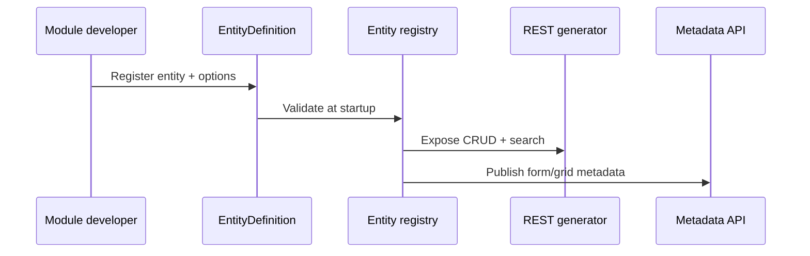

# EMCAP — Architecture

## Layered model (SDD §6)

```
┌─────────────────────────────────────────────────────────┐
│  Presentation: Angular, Flutter, REST, GraphQL        │
├─────────────────────────────────────────────────────────┤
│  Application: Commands, Queries, Use Cases (CQRS)     │
├─────────────────────────────────────────────────────────┤
│  Platform Services: Identity, Entity, Workflow, …      │
├─────────────────────────────────────────────────────────┤
│  Infrastructure: PostgreSQL, Redis, Kafka, S3/MinIO   │
└─────────────────────────────────────────────────────────┘
```

## Repository layout

| Path | Layer | Responsibility |
|------|-------|----------------|
| `clients/web/` | Presentation | Angular metadata-driven UI |
| `clients/mobile/` | Presentation | Flutter metadata-driven UI |
| `platform/api/` | Application + Platform | FastAPI, CQRS, entity SDK, services |
| `modules/` | Application | Business plug-ins (`ModuleDefinition`) |
| `config/` | Cross-cutting | Platform YAML (tenancy, modules, auth) |
| `infra/docker/` | Infrastructure | Local Docker Compose |
| `infra/terraform/` | Infrastructure | Cloud provisioning |
| `infra/helm/` | Infrastructure | Kubernetes releases |

## Dependency rules

1. `modules/` may depend on `platform/` public SDK — never the reverse.
2. `clients/` consume APIs and metadata only — no direct database access.
3. Platform services communicate via defined interfaces; optional subsystems load only when enabled in config.
4. Business modules must not modify files under `platform/`.

## Platform service domains (SDD §7–20)

| Domain | Config namespace | Phase |
|--------|------------------|-------|
| Identity | `authentication.*` | 1 |
| Authorization | RBAC/ABAC policies | 1 |
| Entity framework | `EntityDefinition` | 1 |
| Dynamic UI | form/grid metadata | 2 |
| Workflow | `modules.workflow` | 2 |
| Rules | `rules.*` | 2 |
| Reporting | core | 3 |
| Notifications | `notifications.*` | 3 |
| Documents | entity options | 3 |
| Integrations | module-level | 3 |
| Payments | `payments.*` | 3 |
| AI | `modules.ai` | 3 |
| Observability | built-in | 3 |
| Audit | `audit.*` | 1 |
| Security | middleware + headers | 1 |

## Deployment topology

| Environment | Runtime | SDD § |
|-------------|---------|-------|
| Local | Docker Compose | 21 |
| UAT | Kubernetes | 21 |
| Production | Kubernetes multi-node | 21 |

## Data flow — entity registration



See ADR-001 for monorepo and layering decisions.
